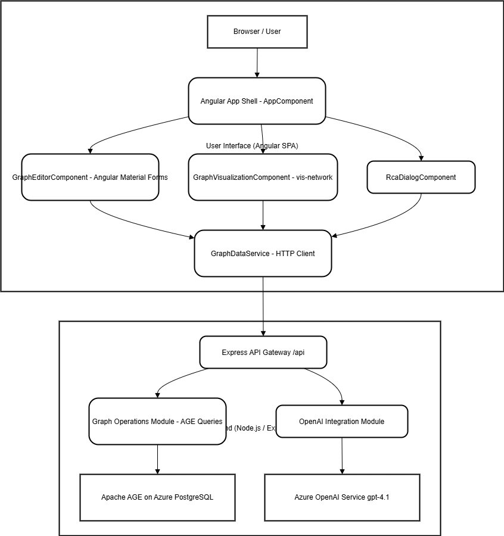

# SulfurGraphExplorer: Apache AGE UI

SulfurGraphExplorer is an Angular-based web application designed to provide a user-friendly interface for interacting with graph data stored in Azure PostgreSQL with the AGE (Apache Graph Extension) extension. This application allows users to visualize graph structures, perform Create, Read, Update, and Delete (CRUD) operations on nodes and relationships, and search for specific graph elements.

This project was generated using [Angular CLI](https://github.com/angular/angular-cli).

## Table of Contents

1.  [Architecture](#architecture)
    *   [Frontend (Angular)](#frontend-angular)
    *   [Backend (Node.js/Express)](#backend-nodejs-express)
    *   [Database (AGE enabled Azure PostgreSQL)](#database-age-enabled-azure-postgresql)
    *   [Architectural Diagram](#architectural-diagram)
    *   [Project Structure](#project-structure)
2.  [Application Flow](#application-flow)
    *   [Data Fetching and Initial Visualization](#data-fetching-and-initial-visualization)
    *   [CRUD Operations Flow](#crud-operations-flow)
    *   [Search Functionality](#search-functionality)
    *   [Editor-Visualization Interaction](#editor-and-visualization-interaction-populating-forms-on-click)
3.  [Component-wise Explanation](#component-wise-explanation)
    *   [Angular Frontend Components](#angular-frontend-components)
        *   [`AppComponent`](#appcomponent)
        *   [`GraphVisualizationComponent`](#graphvisualizationcomponent)
        *   [`GraphEditorComponent`](#grapheditorcomponent)
        *   [`GraphDataService`](#graphdataservice)
    *   [Node.js Backend](#nodejs-backend)
        *   [`backend/src/server.ts`](#backendsrcserverts)
4.  [Core Libraries Used](#core-libraries-used)
5.  [Setup Instructions](#setup-instructions)
    *   [Prerequisites](#prerequisites)
    *   [Backend Setup](#backend-setup)
    *   [Frontend Setup](#frontend-setup)
    *   [Database Setup (Apache AGE on AGE enabled Azure PostgreSQL)](#database-setup-apache-age-on-age-enabled-azure-postgresql)
6.  [How to Run the Application](#how-to-run-the-application)
    *   [1. Start the Backend Server](#1-start-the-backend-server)
    *   [2. Start the Frontend Application](#2-start-the-frontend-application)
7.  [Building the Project](#building-the-project)
8.  [Running Unit Tests](#running-unit-tests)
9.  [Contributing](#contributing)
10. [License](#license)

## Architecture

The application follows a typical client-server architecture:

### Frontend (Angular)

*   **Framework**: Angular (TypeScript)
*   **UI Components**: Angular Material for a consistent look and feel.
*   **Graph Visualization**: `vis-network` library for rendering interactive graph diagrams.
*   **Responsibilities**:
    *   Presenting the user interface.
    *   Handling user interactions (form submissions, clicks on the graph).
    *   Making API calls to the backend to fetch or modify graph data.
    *   Displaying graph data visually.
    *   Managing client-side state.

### Backend (Node.js/Express)

*   **Framework**: Node.js with Express.js (TypeScript)
*   **Database Driver**: `pg` (node-postgres) for connecting to the AGE enabled Azure PostgreSQL database.
*   **Responsibilities**:
    *   Providing a RESTful API for the frontend to consume.
    *   Connecting to the AGE enabled Azure PostgreSQL database.
    *   Translating API requests into Cypher queries (for Apache AGE).
    *   Executing queries against the database and returning results.
    *   Handling business logic related to graph data manipulation.
    *   Managing database connections.

### Database (AGE enabled Azure PostgreSQL)

*   **Type**: Relational Database (AGE enabled Azure PostgreSQL) extended with Graph Database capabilities (Apache AGE).
*   **Query Language**: SQL and Cypher (for graph operations via Apache AGE).
*   **Responsibilities**:
    *   Persistently storing graph data (nodes and relationships with their properties).
    *   Executing Cypher queries to create, read, update, and delete graph elements.
    *   Ensuring data integrity and consistency.

### Architectural Diagram




*(This diagram illustrates the high-level interaction between the frontend, backend, and database components. The Angular frontend communicates with the Node.js/Express backend via HTTP/S. The backend then interacts with the AGE enabled Azure PostgreSQL database, which utilizes the Apache AGE extension for graph operations.)*

### Project Structure

```
pg-graph/
├── backend/                    # Node.js/Express backend application
│   ├── src/
│   │   ├── server.ts           # Main backend server file (Express app, API routes)
│   │   └── ...                 # Other backend TypeScript files (e.g., certs for DB)
│   ├── package.json            # Backend npm dependencies and scripts
│   ├── tsconfig.json           # TypeScript configuration for backend
│   └── .env                    # Environment variables (DB connection, etc.) - GIT IGNORED
├── node_modules/               # Project-level npm dependencies (Angular, etc.) - GIT IGNORED
├── public/
│   └── favicon.ico
├── src/                        # Angular frontend application source
│   ├── app/
│   │   ├── components/
│   │   │   ├── graph-editor/       # Component for CRUD forms and search
│   │   │   │   ├── graph-editor.component.html
│   │   │   │   ├── graph-editor.component.css
│   │   │   │   └── graph-editor.component.ts
│   │   │   └── graph-visualization/  # Component for vis-network graph display
│   │   │       ├── graph-visualization.component.html
│   │   │       ├── graph-visualization.component.css
│   │   │       └── graph-visualization.component.ts
│   │   ├── services/
│   │   │   └── graph-data.service.ts # Service for backend API communication
│   │   ├── app.component.html      # Root component template
│   │   ├── app.component.css       # Root component styles
│   │   ├── app.component.ts        # Root component logic
│   │   ├── app.config.ts           # Main Angular application configuration
│   │   ├── app.config.server.ts    # Server-side rendering configuration
│   │   ├── app.routes.ts           # Client-side application routes
│   │   └── app.routes.server.ts    # Server-side application routes
│   ├── assets/                   # Static assets
│   │   └── images/               # Image assets (e.g., diagrams)
│   │       └── SulfurGraphExplorer.png # Example diagram
│   ├── environments/             # Environment-specific configurations (prod, dev)
│   ├── index.html                # Main HTML page
│   ├── main.ts                   # Main entry point for the Angular application (client)
│   ├── main.server.ts            # Main entry point for server-side rendering
│   ├── server.ts                 # Angular Universal server setup
│   └── styles.css                # Global styles
├── .angular/                   # Angular cache and build artifacts - GIT IGNORED
├── .gitignore                  # Specifies intentionally untracked files that Git should ignore
├── angular.json                # Angular CLI workspace configuration
├── LICENSE                     # Project license file (MIT)
├── package.json                # Frontend npm dependencies and scripts
├── README.md                   # This file: project documentation
├── tsconfig.json               # Root TypeScript configuration for the workspace
├── tsconfig.app.json           # TypeScript configuration for the Angular app
└── tsconfig.spec.json          # TypeScript configuration for tests
```

## Application Flow

### Data Fetching and Initial Visualization

1.  **App Initialization**: When the Angular application loads, `AppComponent` is the root.
2.  **Visualization Component**: `GraphVisualizationComponent` is responsible for displaying the graph.
3.  **Service Request**: On initialization (`ngOnInit`), `GraphVisualizationComponent` calls `GraphDataService.getGraphData()`.
4.  **API Call**: `GraphDataService` makes an HTTP GET request to the backend API endpoint (e.g., `/api/graph`).
5.  **Backend Processing**: The backend server receives the request, queries the Apache AGE database for all nodes and edges.
    *   It typically executes Cypher queries like `MATCH (n) RETURN n;` and `MATCH ()-[r]->() RETURN r;`.
    *   The results are formatted into a structure containing `nodes` and `edges` arrays (e.g., `{ nodes: [...], edges: [...] }`).
6.  **API Response**: The backend sends the graph data back to the frontend as a JSON response.
7.  **Service Receives Data**: `GraphDataService` receives the response and passes it to `GraphVisualizationComponent`.
8.  **Graph Rendering**: `GraphVisualizationComponent` uses the received data to instantiate and render the graph using the `vis-network` library.

### CRUD Operations Flow

When a user performs a CRUD (Create, Read, Update, Delete) operation:

1.  **UI Interaction (`GraphEditorComponent`)**:
    *   The user interacts with forms or buttons in `GraphEditorComponent` (or future dedicated components).
    *   This component captures data (e.g., new node's label, properties; ID of a node to update/delete).
2.  **Service Call (`GraphDataService`)**:
    *   The UI component calls a method in `GraphDataService` (e.g., `createNode()`, `updateNode()`, `deleteNode()`, `createEdge()`).
3.  **HTTP Request to Backend**:
    *   `GraphDataService` sends an HTTP request (e.g., `POST` for create, `PUT` for update, `DELETE` for delete) to the backend API (e.g., `/api/node`, `/api/node/:id`, `/api/edge`).
4.  **Backend API Processing (`backend/src/server.ts`)**:
    *   The backend API receives the request.
    *   The route handler parses the request and constructs the appropriate Cypher query.
    *   Example (Create Node): `CREATE (:NewLabel {prop1: 'value1'});`
    *   Example (Update Node): `MATCH (n) WHERE id(n) = <node_id> SET n.label = 'NewLabel', n.prop1 = 'new_value';`
    *   The query is executed against Apache AGE.
5.  **Database Operation**: Apache AGE modifies the graph data.
6.  **Backend Response**: The backend API sends a response (e.g., the created/updated element, or a success message).
    *   For `DELETE /api/node/:id`, the backend returns `{ message: string, deletedNodeId: string }`.
7.  **Service Receives Response**: `GraphDataService` gets the response.
8.  **UI Update & Feedback**:
    *   The UI component receives data/confirmation.
    *   Crucially, `AppComponent` is notified (e.g., via an event emitter like `graphChanged` from `GraphEditorComponent`).
    *   `AppComponent` then calls a method on `GraphVisualizationComponent` (e.g., `refreshGraphData()`) to re-fetch the entire graph, ensuring the visualization is up-to-date.

### Node CRUD API Endpoints

The backend (`backend/src/server.ts`) provides the following RESTful API endpoints for managing nodes:

*   **Create Node:** `POST /api/node`
    *   **Request Body:** JSON object representing the node to create.
        ```json
        {
          "label": "WorkOrder",
          "properties": {
            "work_order_id": "WO12345",
            "status": "Open",
            "description": "Routine maintenance check"
          }
        }
        ```
    *   **Response Body:** JSON object of the created node, including its auto-generated graph ID.
        ```json
        {
          "id": "10133099161583620", // Example graph ID
          "label": "WorkOrder",
          "properties": {
            "work_order_id": "WO12345",
            "status": "Open",
            "description": "Routine maintenance check"
          }
        }
        ```
    *   **Angular Service Method:** `GraphDataService.createNode(nodeData: Omit<VisNode, 'id'>)`
    *   **Backend Handler:** `createNodeHandler`

*   **Read Node:** `GET /api/node/:id`
    *   **URL Parameter:** `:id` - The graph ID of the node to retrieve.
    *   **Response Body:** JSON object of the requested node.
        ```json
        {
          "id": "10133099161583620",
          "label": "WorkOrder",
          "properties": { /* ... */ }
        }
        ```
    *   **Angular Service Method:** `GraphDataService.getNode(id: string | number)`
    *   **Backend Handler:** `getNodeByIdHandler`

*   **Update Node:** `PUT /api/node/:id`
    *   **URL Parameter:** `:id` - The graph ID of the node to update.
    *   **Request Body:** JSON object with properties to update. Can include `label` and/or `properties`.
        ```json
        {
          "label": "UpdatedWorkOrderLabel", // Optional
          "properties": {
            "status": "Closed",
            "resolution": "Completed successfully"
          }
        }
        ```
    *   **Response Body:** JSON object of the updated node.
    *   **Angular Service Method:** `GraphDataService.updateNode(id: string | number, nodeData: Partial<VisNode>)`
    *   **Backend Handler:** `updateNodeHandler`

*   **Delete Node:** `DELETE /api/node/:id`
    *   **URL Parameter:** `:id` - The graph ID of the node to delete.
    *   **Response Body:** JSON object confirming deletion.
        ```json
        {
          "message": "Node deleted successfully",
          "deletedNodeId": "10133099161583620"
        }
        ```
    *   **Angular Service Method:** `GraphDataService.deleteNode(id: string | number)`
    *   **Backend Handler:** `deleteNodeHandler`

### Edge CRUD API Endpoints

**(Note: While the API endpoints and corresponding service methods for Edge CRUD operations are implemented, they are pending comprehensive end-to-end testing. Please refer to the 'Current Development Status' section for more details.)**

The backend (`backend/src/server.ts`) provides the following RESTful API endpoints for managing edges. Note that edge IDs are also string representations of their internal numeric AGE IDs, similar to nodes.

*   **Create Edge:** `POST /api/edge`
    *   **Request Body:** JSON object representing the edge to create.
        ```json
        {
          "from": "10133099161583618", // Source Node Graph ID (stringified internal numeric ID)
          "to": "10133099161583620",   // Target Node Graph ID (stringified internal numeric ID)
          "label": "RELATED_TO",
          "properties": {
            "relationship_type": "dependency",
            "strength": 0.75
          }
        }
        ```
    *   **Response Body:** JSON object of the created edge, including its auto-generated graph ID (stringified internal numeric ID).
        ```json
        {
          "id": "11258999068426243", // Example graph ID for an edge (stringified internal numeric ID)
          "from": "10133099161583618",
          "to": "10133099161583620",
          "label": "RELATED_TO", // This is the agtype label of the edge
          "title": "{\n  \"relationship_type\": \"dependency\",\n  \"strength\": 0.75\n}", // Stringified properties for tooltip
          "properties": {
            "relationship_type": "dependency",
            "strength": 0.75
            // If the edge label was set as a property, it would also appear here, e.g., "label": "RELATED_TO_AS_PROP"
          }
        }
        ```
    *   **Angular Service Method:** `GraphDataService.createEdge(edgeData: Omit<VisEdge, 'id'>)`
    *   **Backend Handler:** `createEdgeHandler`

*   **Read Edge:** `GET /api/edge/:id`
    *   **URL Parameter:** `:id` - The graph ID of the edge to retrieve (stringified internal numeric ID, e.g., "11258999068426243").
    *   **Response Body:** JSON object of the requested edge.
        ```json
        {
          "id": "11258999068426243",
          "from": "10133099161583618",
          "to": "10133099161583620",
          "label": "RELATED_TO",
          "properties": { /* ... */ }
        }
        ```
    *   **Angular Service Method:** `GraphDataService.getEdge(id: string)`
    *   **Backend Handler:** `getEdgeByIdHandler`

*   **Update Edge:** `PUT /api/edge/:id`
    *   **URL Parameter:** `:id` - The graph ID of the edge to update (stringified internal numeric ID).
    *   **Request Body:** JSON object with properties to update. 
        *Note: To change the edge's fundamental `label` (its type in AGE), you typically delete and recreate the edge with the new label. The `properties` can include a `label` field for display purposes, but this won't change the underlying AGE edge type if you are just updating properties.*
        ```json
        {
          "properties": {
            "strength": 0.95,
            "status": "verified",
            "label": "Updated Display Label" // This updates a property named 'label'
          }
        }
        ```
    *   **Response Body:** JSON object of the updated edge.
    *   **Angular Service Method:** `GraphDataService.updateEdge(id: string, edgeData: Partial<Omit<VisEdge, 'from' | 'to'>>)`
    *   **Backend Handler:** `updateEdgeHandler`

*   **Delete Edge:** `DELETE /api/edge/:id`
    *   **URL Parameter:** `:id` - The graph ID of the edge to delete (stringified internal numeric ID).
    *   **Response Body:** JSON object confirming deletion.
        ```json
        {
          "message": "Edge deleted successfully",
          "id": "11258999068426243" // The ID of the deleted edge
        }
        ```
    *   **Angular Service Method:** `GraphDataService.deleteEdge(id: string)`
    *   **Backend Handler:** `deleteEdgeHandler`

### Search Functionality

1.  **User Input (`GraphEditorComponent`)**: The user enters search criteria (e.g., node label, property value) in the `GraphEditorComponent`.
2.  **Event Emission**: `GraphEditorComponent` emits a `searchSubmitted` event with the search query.
3.  **`AppComponent` Handling**: `AppComponent` listens for this event and calls a method on `GraphVisualizationComponent`, passing the search query.
4.  **Service Request (`GraphVisualizationComponent` -> `GraphDataService`)**: `GraphVisualizationComponent` (or `GraphDataService` directly) makes an API call to a search endpoint (e.g., `GET /api/search?query=...`).
5.  **Backend Search Processing**: The backend API receives the search query.
    *   It constructs a Cypher query to find matching nodes/edges.
    *   Example: `MATCH (n) WHERE n.name CONTAINS 'search_term' OR n.label = 'search_term' RETURN n;`
6.  **API Response**: The backend returns the search results (a subset of the graph or relevant data).
7.  **Display Results**: `GraphVisualizationComponent` updates its display to highlight or filter based on the search results. (This part may involve re-rendering or using `vis-network`'s filtering capabilities).

### Editor and Visualization Interaction (Populating Forms on Click)

This allows users to click a node/edge in the visualization and see its details in the editor:

1.  **Click Event (`GraphVisualizationComponent`)**:
    *   User clicks a node/edge in the `vis-network` canvas.
    *   `GraphVisualizationComponent`'s click handler identifies the clicked element.
    *   It emits `nodeClicked` or `edgeClicked` event with the `VisNode` or `VisEdge` object.
2.  **Event Handling (`AppComponent`)**:
    *   `AppComponent` listens for these events.
    *   Its handler (e.g., `handleNodeClicked()`) updates `selectedNodeForEditor` or `selectedEdgeForEditor` properties.
3.  **Input Binding to `GraphEditorComponent`**:
    *   `AppComponent` passes `selectedNodeForEditor` and `selectedEdgeForEditor` to `GraphEditorComponent` via input bindings (`[selectedNode]`, `[selectedEdge]`).
4.  **`OnChanges` in `GraphEditorComponent`**:
    *   `GraphEditorComponent.ngOnChanges()` is triggered when its input properties change.
    *   It populates the editor form fields (node ID, label, properties, or edge ID, label, properties, from/to) based on the received `selectedNode` or `selectedEdge`.
5.  **Manual Fetch Option**:
    *   `GraphEditorComponent` also allows users to type an ID into "Node ID to Select" or "Edge ID to Select" fields.
    *   Clicking "Fetch Details" calls `selectNodeForUpdate()` or `selectEdgeForUpdate()`.
    *   These methods use `GraphDataService.getNode(id)` or `GraphDataService.getEdge(id)` to fetch details from the backend.
    *   The fetched data then updates the component's internal reference to the selected node or edge, and the component directly populates the form fields with this data.

## Current Development Status

The application is under active development. Key functionalities include:

*   **Node Management**: Full CRUD (Create, Read, Update, Delete) operations for graph nodes, including their properties, are implemented and have been tested and working however, these operations are pending comprehensive end-to-end testing.
*   **Edge Management**: Backend API endpoints and frontend service methods for Edge CRUD operations (Create, Read, Update, Delete), including their properties, are implemented. However, these operations are pending comprehensive end-to-end testing.
*   **Graph Visualization**: Core graph rendering, display of nodes and edges with labels and properties (in tooltips), and basic interaction (click to select) are implemented.
*   **Data Interaction**:
    *   The editor panel can be populated by clicking nodes/edges in the visualization.
    *   Nodes/edges can be fetched by ID for editing.
    *   The graph visualization refreshes after CUD operations.
*   **Search**: The UI for search submission is present, and the application flow for relaying search queries to the visualization component is established. Backend search logic and comprehensive frontend result display are areas for further development and testing.

## Component-wise Explanation

### Angular Frontend Components

#### `AppComponent` (`src/app/app.component.ts`, `.html`, `.css`)

*   **Role**: The root component of the Angular application. It acts as the main container for other components.
*   **Responsibilities**:
    *   Sets up the main layout, including the toolbar.
    *   Hosts the `GraphEditorComponent` and the `GraphVisualizationComponent` (via `<router-outlet>`).
    *   Manages the interaction between the editor and visualization components.
        *   Handles `nodeClicked` and `edgeClicked` events from `GraphVisualizationComponent` to update `selectedNodeForEditor` and `selectedEdgeForEditor`.
        *   Passes these selected items as inputs to `GraphEditorComponent`.
        *   Handles `graphChanged` events from `GraphEditorComponent` to trigger a refresh in `GraphVisualizationComponent`.
        *   Handles `searchSubmitted` events from `GraphEditorComponent` and passes the query to `GraphVisualizationComponent`.
*   **Key Properties**:
    *   `title`: For the application toolbar.
    *   `selectedNodeForEditor`: Holds the node currently selected for editing.
    *   `selectedEdgeForEditor`: Holds the edge currently selected for editing.
*   **Key Methods**:
    *   `handleNodeClicked()`: Updates `selectedNodeForEditor` when a node is clicked in the visualization.
    *   `handleEdgeClicked()`: Updates `selectedEdgeForEditor` when an edge is clicked.
    *   `handleGraphChanged()`: Triggers a data refresh in the visualization component.
    *   `handleSearchSubmitted()`: Relays search queries.

#### `GraphVisualizationComponent` (`src/app/components/graph-visualization/`)

*   **Role**: Responsible for rendering and interacting with the graph visualization.
*   **Responsibilities**:
    *   Fetching the initial graph data from `GraphDataService`.
    *   Initializing and configuring the `vis-network` instance.
    *   Rendering nodes and edges on an HTML5 canvas.
    *   Handling user interactions within the graph (e.g., clicks, drags, zoom).
    *   Emitting `nodeClicked` and `edgeClicked` events when graph elements are selected by the user.
    *   Providing a `refreshGraphData()` method that can be called externally (e.g., by `AppComponent`) to re-fetch and re-render the graph.
    *   (Future) Displaying search results by highlighting or filtering nodes/edges.
*   **Key Properties**:
    *   `visNetworkContainer`: An `ElementRef` pointing to the `div` where `vis-network` will render the graph.
    *   `networkInstance`: The `vis-network` Network object.
    *   `graphData`: Stores the current nodes and edges being displayed.
    *   `nodeClicked`, `edgeClicked`: `EventEmitter`s for outputting selection events.
*   **Key Methods**:
    *   `ngOnInit()`: Fetches initial graph data.
    *   `ngAfterViewInit()`: Initializes the `vis-network` instance once the view is ready.
    *   `tryLoadGraph()` / `loadGraphActual()`: Core logic for setting up `vis-network` with data and options. This includes processing nodes/edges for tooltips and creating `DataSet` objects for `vis-network`.
    *   `fetchAndLoadGraph()`: Fetches data using the service and then attempts to load it.
    *   `refreshGraphData()`: Public method to re-trigger `fetchAndLoadGraph()`.
    *   Event handlers for `vis-network` click events.

#### `GraphEditorComponent` (`src/app/components/graph-editor/`)

*   **Role**: Provides UI forms for creating, updating, deleting, and searching graph nodes and edges.
*   **Responsibilities**:
    *   Displaying forms for node properties (ID, label, JSON properties).
    *   Displaying forms for edge properties (ID, label, JSON properties, From Node ID, To Node ID).
    *   Handling form submissions for CRUD operations and search.
    *   Calling appropriate methods on `GraphDataService` to execute these operations.
    *   Emitting a `graphChanged` event after successful CUD operations to signal that the visualization needs to be refreshed.
    *   Emitting a `searchSubmitted` event with the search query.
    *   Populating form fields when `selectedNode` or `selectedEdge` inputs are updated (via `ngOnChanges`).
    *   Allowing users to fetch node/edge details by ID for editing.
*   **Key Properties (Inputs)**:
    *   `selectedNode`: The node object passed from `AppComponent` when a node is clicked in the visualization.
    *   `selectedEdge`: The edge object passed from `AppComponent`.
*   **Key Properties (Form Models)**:
    *   `createNodeLabel`, `createNodePropertiesString`, etc. for node/edge creation forms.
    *   `updateNodeId`, `updateNodeLabel`, `updatePropertiesString`, etc. for update forms.
    *   `deleteNodeId`, `deleteEdgeId` for deletion.
    *   `searchQuery` for search.
    *   `selectedNodeId`, `selectedEdgeId` for fetching details.
*   **Key Properties (Outputs)**:
    *   `graphChanged`: `EventEmitter` to notify parent about data modifications.
    *   `searchSubmitted`: `EventEmitter` to send search queries.
*   **Key Methods**:
    *   `ngOnChanges()`: Detects changes to `selectedNode`/`selectedEdge` inputs and populates forms.
    *   `onCreateNode()`, `onUpdateNode()`, `onDeleteNode()`, etc.: Handle form submissions, call service methods, and emit `graphChanged`.
    *   `onSearch()`: Emits `searchSubmitted`.
    *   `selectNodeForUpdate()`, `selectEdgeForUpdate()`: Fetch node/edge details by ID using the service.
    *   Helper methods for parsing/stringifying JSON properties.

#### `GraphDataService` (`src/app/services/graph-data.service.ts`)

*   **Role**: Acts as an intermediary between the Angular components and the backend API.
*   **Responsibilities**:
    *   Encapsulating all HTTP communication with the backend.
    *   Providing methods for fetching the entire graph (`getGraphData()`).
    *   Providing methods for CRUD operations on nodes (e.g., `createNode()`, `getNode()`, `updateNode()`, `deleteNode()`).
    *   Providing methods for CRUD operations on edges (e.g., `createEdge()`, `getEdge()`, `updateEdge()`, `deleteEdge()`).
    *   Providing a method for searching the graph (`searchGraph()`).
    *   Transforming request/response data if necessary.
    *   Handling HTTP errors.
*   **Key Methods**: Each method typically uses Angular's `HttpClient` to make a request to a specific backend endpoint and returns an `Observable`.
    *   `getGraphData()`: GET `/api/graph`
    *   `createNode(data)`: POST `/api/node`
    *   `getNode(id)`: GET `/api/node/:id`
    *   `updateNode(id, data)`: PUT `/api/node/:id`
    *   `deleteNode(id)`: DELETE `/api/node/:id`
    *   (Similar methods for edges: `createEdge`, `getEdge`, `updateEdge`, `deleteEdge` targeting `/api/edge` and `/api/edge/:id`)
    *   `searchGraph(query)`: GET `/api/search?query=...`
*   **Interfaces**: Defines `VisNode`, `VisEdge`, and `GraphData` interfaces for type safety.

### Node.js Backend

#### `backend/src/server.ts`

*   **Role**: The main file for the backend Express.js application.
*   **Responsibilities**:
    *   Setting up the Express application.
    *   Configuring middleware (e.g., CORS for allowing requests from the Angular frontend, body-parser for JSON request bodies).
    *   Defining API routes/endpoints for:
        *   Fetching the entire graph (`/api/graph`).
        *   Node CRUD operations (`/api/node`, `/api/node/:id`).
        *   Edge CRUD operations (`/api/edge`, `/api/edge/:id`).
        *   Search (`/api/search`).
    *   Connecting to the AGE enabled Azure PostgreSQL database using the `pg` library (connection pool).
    *   Executing Cypher queries against Apache AGE for each API endpoint.
        *   This involves constructing Cypher strings dynamically based on request parameters/body.
        *   Using `await pool.query('LOAD \'age\';');` and `await pool.query('SET search_path = ag_catalog, \"$user\", public;');` before AGE operations.
    *   Formatting database results into appropriate JSON responses for the frontend.
    *   Handling errors during database operations or request processing.
    *   Starting the HTTP server to listen for incoming requests.
*   **Key Libraries Used**:
    *   `express`: Web framework.
    *   `pg`: PostgreSQL client.
    *   `cors`: CORS middleware.
    *   `dotenv`: For managing environment variables (like database connection details).
*   **Key Functions/Route Handlers**:
    *   `app.get('/api/graph', ...)`: Fetches all nodes and edges.
    *   `app.post('/api/node', ...)`: Creates a new node.
    *   `app.get('/api/node/:id', ...)`: Fetches a specific node by its AGE-internal ID.
    *   `app.put('/api/node/:id', ...)`: Updates a node.
    *   `app.delete('/api/node/:id', ...)`: Deletes a node.
    *   (Similar handlers for `/api/edge` routes).
    *   `app.get('/api/search', ...)`: Performs a search based on query parameters.
    *   Helper functions to convert AGE `agtype` data to standard JSON.

## Core Libraries Used

*   **Angular**: `^19.2.0` (Core, Common, Compiler, Forms, Platform Browser, Router, etc.)
*   **Angular Material**: `^19.2.17`
*   **vis-network**: `^9.1.10`
*   **Node.js**: (Runtime, version depends on your installed environment, e.g., `^18.18.0` or `^22.15.21` as seen in `@types/node` devDependencies)
*   **Express.js**: Frontend uses `^4.18.2` (via `@angular/ssr`), Backend uses `^5.1.0`
*   **TypeScript**: Frontend uses `~5.7.2`, Backend uses `^5.8.3`
*   **pg (node-postgres)**: `^8.16.0` (Backend)
*   **Apache AGE**: (Graph extension, version depends on your database setup)
*   **RxJS**: `~7.8.0` (Frontend)
*   **cors**: `^2.8.5` (Backend)
*   **dotenv**: `^16.5.0` (Backend)

## Setup Instructions

### Prerequisites

*   **Node.js and npm**: Ensure Node.js (which includes npm) is installed. LTS version is recommended. (https://nodejs.org/)
*   **Angular CLI**: Install globally: `npm install -g @angular/cli`
*   **AGE enabled Azure PostgreSQL**: A running instance of AGE enabled Azure PostgreSQL.
*   **Apache AGE**: The Apache AGE extension must be installed and enabled on your AGE enabled Azure PostgreSQL instance. Follow the official Apache AGE installation guide.
*   **Git**: For cloning the repository (if applicable).

### Backend Setup (`backend/` directory)

1.  **Navigate to backend directory**:
    ```bash
    cd backend
    ```
2.  **Install dependencies**:
    ```bash
    npm install
    ```
3.  **Create Environment File**:
    *   Create a `.env` file in the `backend/` directory.
    *   Copy the contents of `backend/.env.example` (if provided) or add the following, replacing with your actual database credentials:
        ```env
        PGHOST=your_db_host
        PGUSER=your_db_user
        PGPASSWORD=your_db_password
        PGDATABASE=your_age_database_name
        PGPORT=your_db_port (e.g., 5432)

        # For SSL (if your Azure PostgreSQL requires it)
        PGSSLMODE=require # or verify-full, etc.
        # PGSSLROOTCERT=/path/to/your/ca-certificate.crt # Example if using self-signed or specific CA
        ```
    *   **Important for Azure PostgreSQL SSL**: If connecting to AGE enabled Azure PostgreSQL with SSL, ensure you have the necessary CA certificate (e.g., `DigiCertGlobalRootG2.crt.pem`). You might need to set `PGSSLMODE=verify-full` and provide the path to the root certificate via `PGSSLROOTCERT` or configure the `pg.Pool` with `ssl: { rejectUnauthorized: true, ca: fs.readFileSync(...) }` in `backend/src/server.ts`. The current `server.ts` might have SSL settings commented out or set to `rejectUnauthorized: false` for easier local development without SSL. **For production or secure connections, always use proper SSL verification.**
4.  **Compile TypeScript (Optional - `npm start` does this)**:
    ```bash
    npm run build
    ```

### Frontend Setup (Root project directory `pg-graph/`)

1.  **Navigate to project root directory** (if you were in `backend/`):
    ```bash
    cd ..
    ```
2.  **Install dependencies**:
    ```bash
    npm install
    ```

### Database Setup (Apache AGE on AGE enabled Azure PostgreSQL)

*   Ensure Apache AGE is installed and set up correctly on your Azure PostgreSQL server.
*   Create a database that will be used for this application.
*   Load the AGE extension into this database:
    ```sql
    CREATE EXTENSION IF NOT EXISTS age;
    ```
*   Set the search path (usually done per session by the backend, but good to be aware of):
    ```sql
    LOAD 'age';
    SET search_path = ag_catalog, "$user", public;
    ```
*   You might need to create an initial graph if the application expects one:
    ```sql
    SELECT create_graph('my_graph_name'); -- The backend currently uses the default graph, so this might not be strictly needed if the default graph is implicitly used.
    ```

## How to Run the Application

You need to run both the backend server and the frontend development server.

### 1. Start the Backend Server

*   Open a terminal in the `backend/` directory.
*   Run:
    ```bash
    npm start
    ```
*   This will typically compile the TypeScript and start the Node.js/Express server, usually on a port like `3000` (check console output).

### 2. Start the Frontend Application

*   Open another terminal in the root project directory (`pg-graph/`).
*   Run:
    ```bash
    ng serve
    ```
    Or, if you have a specific start script in `package.json` (like `npm start` which internally calls `ng serve`):
    ```bash
    npm start
    ```
*   This will start the Angular development server, usually on `http://localhost:4200/`.
*   Open your browser and navigate to `http://localhost:4200/`. The application will automatically reload if you change any of the frontend source files.

## Building the Project

### Backend

To create a production build for the backend (JavaScript files in `backend/dist`):
```bash
cd backend
npm run build
```
You can then run the compiled backend using `node dist/server.js`.

### Frontend

To build the frontend project for production:
```bash
ng build --configuration production
# or simply `ng build` if your angular.json defaults to production for `ng build`
```
The build artifacts will be stored in the `dist/sulfur-graph-explorer` (or similar, check `angular.json`) directory.

## Running Unit Tests

(Placeholder - Test setup and writing tests are future tasks)

To execute unit tests with [Karma](https://karma-runner.github.io) (once configured):
```bash
ng test
```

## Contributing

(Placeholder - Contribution guidelines can be added here if the project becomes open source or collaborative.)
*   Fork the repository.
*   Create a new branch (`git checkout -b feature/your-feature-name`).
*   Make your changes.
*   Commit your changes (`git commit -am 'Add some feature'`).
*   Push to the branch (`git push origin feature/your-feature-name`).
*   Create a new Pull Request.

## License

This project is licensed under the MIT License - see the [LICENSE](LICENSE) file for details.
