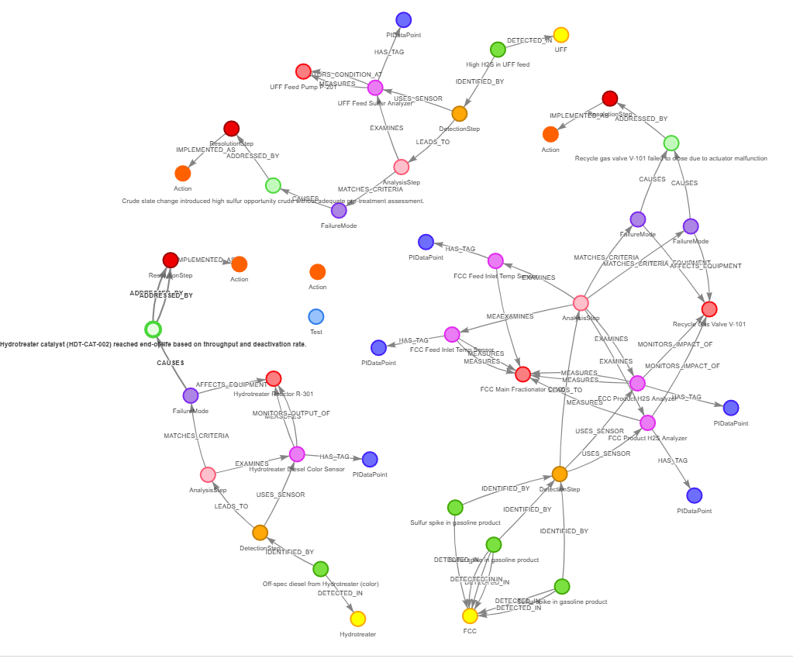

# SulfurGraphExplorer: Apache AGE UI

**SulfurGraphExplorer** is an Angular-based web application designed to provide a
user-friendly interface for interacting with graph data stored in an Apache AGE
database, specifically tailored for Azure PostgreSQL. It allows users to
visualize, create, read, update, and delete (CRUD) graph nodes and
relationships. Recent enhancements include a Root Cause Analysis (RCA) feature
powered by Azure OpenAI, enabling users to gain deeper insights from their graph
data by leveraging LLM capabilities to analyze selected nodes and their
neighborhoods. The application features an interactive graph visualization, an
editor panel for data manipulation, and search functionality.

## Table of Contents

* [High-Level Overview](#high-level-overview)
* [Key Features](#key-features)
* [Technology Stack](#technology-stack)
* [Application Architecture](#application-architecture)
  * [Architecture Diagram (Mermaid)](#architecture-diagram-mermaid)
* [Application Flow](#application-flow)
  * [Data Fetching and Initial Visualization](#data-fetching-and-initial-visualization)
  * [CRUD Operations Flow](#crud-operations-flow)
  * [Search Functionality Flow](#search-functionality-flow)
  * [Editor and Visualization Interaction (Populating Forms on Click)](#editor-and-visualization-interaction-populating-forms-on-click)
  * [Root Cause Analysis (RCA) Flow](#root-cause-analysis-rca-flow)
* [API Endpoints](#api-endpoints)
  * [Node CRUD API Endpoints](#node-crud-api-endpoints)
  * [Edge CRUD API Endpoints](#edge-crud-api-endpoints)
  * [Search API Endpoint](#search-api-endpoint)
  * [RCA API Endpoint](#rca-api-endpoint)
* [Current Development Status](#current-development-status)
* [Component-wise Explanation](#component-wise-explanation)
  * [Angular Frontend Components](#angular-frontend-components)
  * [Node.js Backend](#nodejs-backend)
* [Project Directory Structure](#project-directory-structure)
* [Core Libraries Used](#core-libraries-used)
* [Setup Instructions](#setup-instructions)
  * [Prerequisites](#prerequisites)
  * [Backend Setup](#backend-setup-backend-directory)
  * [Frontend Setup](#frontend-setup-root-project-directory-pg-graph)
  * [Database Setup](#database-setup-apache-age-on-age-enabled-azure-postgresql)
* [How to Run the Application](#how-to-run-the-application)
* [Building the Project](#building-the-project)
* [Running Unit Tests](#running-unit-tests)
* [Contributing](#contributing)
* [License](#license)

## High-Level Overview

SulfurGraphExplorer is an Angular-based web application designed to provide a
user-friendly interface for interacting with graph data stored in Azure
PostgreSQL with the AGE (Apache Graph Extension) extension. This application
allows users to visualize graph structures, perform Create, Read, Update, and
Delete (CRUD) operations on nodes and relationships, and search for specific
graph elements.


## Key Features

* **Interactive Graph Visualization**: Uses `vis-network` to render and interact
  with graph data.
* **CRUD Operations**: Full support for creating, reading, updating, and
  deleting nodes and edges with their properties.
* **Property Editor**: A dedicated panel to view and modify the properties of
  selected nodes and edges.
* **Search Functionality**: Allows users to search for nodes and edges based on
  labels or property values.
* **Root Cause Analysis (RCA)**: Integrates with Azure OpenAI (e.g., gpt-4.1)
  to provide AI-driven analysis of selected nodes and their local graph
  neighborhood to suggest potential root causes or insights.
* **Real-time Updates**: The graph visualization refreshes automatically after
  CRUD operations.
* **Backend API**: A Node.js/Express backend that communicates with Apache AGE
  on Azure PostgreSQL.

## Technology Stack

* **Frontend**: Angular, Angular Material, vis-network
* **Backend**: Node.js, Express.js, pg (node-postgres)
* **Database**: Apache AGE on Azure PostgreSQL
* **AI Integration**: Azure OpenAI (e.g., gpt-4.1)

## Application Architecture

The application follows a typical client-server architecture:

### Frontend (Angular)

* **Framework**: Angular (TypeScript)
* **UI Components**: Angular Material for a consistent look and feel.
* **Graph Visualization**: `vis-network` library for rendering interactive graph
  diagrams.
* **Responsibilities**:
  * Presenting the user interface.
  * Handling user interactions (form submissions, clicks on the graph).
  * Making API calls to the backend to fetch or modify graph data.
  * Displaying graph data visually.
  * Managing client-side state.

### Backend (Node.js/Express)

* **Framework**: Node.js with Express.js (TypeScript)
* **Database Driver**: `pg` (node-postgres) for connecting to the AGE enabled
  Azure PostgreSQL database.
* **Responsibilities**:
  * Providing a RESTful API for the frontend to consume.
  * Connecting to the AGE enabled Azure PostgreSQL database.
  * Translating API requests into Cypher queries (for Apache AGE).
  * Executing queries against the database and returning results.
  * Handling business logic related to graph data manipulation.
  * Managing database connections.

### Database (AGE enabled Azure PostgreSQL)

* **Type**: Relational Database (AGE enabled Azure PostgreSQL) extended with
  Graph Database capabilities (Apache AGE).
* **Query Language**: SQL and Cypher (for graph operations via Apache AGE).
* **Responsibilities**:
  * Persistently storing graph data (nodes and relationships with their
    properties).
  * Executing Cypher queries to create, read, update, and delete graph
    elements.
  * Ensuring data integrity and consistency.

### Architecture Diagram

(The diagram above illustrates the architecture)




## Application Flow

### Data Fetching and Initial Visualization

1. **App Initialization**: When the Angular application loads, `AppComponent` is
   the root.
2. **Visualization Component**: `GraphVisualizationComponent` is responsible for
   displaying the graph.
3. **Service Request**: On initialization (`ngOnInit`),
   `GraphVisualizationComponent` calls `GraphDataService.getGraphData()`.
4. **API Call**: `GraphDataService` makes an HTTP GET request to the backend API
   endpoint (e.g., `/api/graph`).
5. **Backend Processing**: The backend server receives the request, queries the
   Apache AGE database for all nodes and edges.
   * It typically executes Cypher queries like `MATCH (n) RETURN n;` and
     `MATCH ()-[r]->() RETURN r;`.
   * The results are formatted into a structure containing `nodes` and `edges`
     arrays (e.g., `{ nodes: [...], edges: [...] }`).
6. **API Response**: The backend sends the graph data back to the frontend as a
   JSON response.
7. **Service Receives Data**: `GraphDataService` receives the response and
   passes it to `GraphVisualizationComponent`.
8. **Graph Rendering**: `GraphVisualizationComponent` uses the received data to
   instantiate and render the graph using the `vis-network` library.

### CRUD Operations Flow

When a user performs a CRUD (Create, Read, Update, Delete) operation:

1. **UI Interaction (`GraphEditorComponent`)**:
   * The user interacts with forms or buttons in `GraphEditorComponent` (or
     future dedicated components).
   * This component captures data (e.g., new node's label, properties; ID of a
     node to update/delete).
2. **Service Call (`GraphDataService`)**:
   * The UI component calls a method in `GraphDataService` (e.g.,
     `createNode()`, `updateNode()`, `deleteNode()`, `createEdge()`).
3. **HTTP Request to Backend**:
   * `GraphDataService` sends an HTTP request (e.g., `POST` for create, `PUT`
     for update, `DELETE` for delete) to the backend API (e.g., `/api/node`,
     `/api/node/:id`, `/api/edge`).
4. **Backend API Processing (`backend/src/server.ts`)**:
   * The backend API receives the request.
   * The route handler parses the request and constructs the appropriate Cypher
     query.
   * Example (Create Node): `CREATE (:NewLabel {prop1: 'value1'});`
   * Example (Update Node):
     `MATCH (n) WHERE id(n) = <node_id> SET n.label = 'NewLabel', n.prop1 = 'new_value';`
   * The query is executed against Apache AGE.
5. **Database Operation**: Apache AGE modifies the graph data.
6. **Backend Response**: The backend API sends a response (e.g., the
   created/updated element, or a success message).
   * For `DELETE /api/node/:id`, the backend returns
     `{ message: string, deletedNodeId: string }`.
7. **Service Receives Response**: `GraphDataService` gets the response.
8. **UI Update & Feedback**:
   * The UI component receives data/confirmation.
   * `AppComponent` then calls a method on `GraphVisualizationComponent` (e.g.,
     `refreshGraphData()`) to re-fetch the entire graph, ensuring the
     visualization is up-to-date.

### Search Functionality Flow

1. **User Input (`GraphEditorComponent`)**: The user enters search criteria
   (e.g., node label, property value) in the `GraphEditorComponent`.
2. **Event Emission**: `GraphEditorComponent` emits a `searchSubmitted` event
   with the search query.
3. **`AppComponent` Handling**: `AppComponent` listens for this event and calls
   a method on `GraphVisualizationComponent`, passing the search query.
4. **Service Request (`GraphVisualizationComponent` -> `GraphDataService`)**:
   `GraphVisualizationComponent` (or `GraphDataService` directly) makes an API
   call to a search endpoint (e.g., `GET /api/search?query=...`).
5. **Backend Search Processing**: The backend API receives the search query.
   * It constructs a Cypher query to find matching nodes/edges.
   * Example:
     `MATCH (n) WHERE n.name CONTAINS 'search_term' OR n.label = 'search_term' RETURN n;`
6. **API Response**: The backend returns the search results (a subset of the
   graph or relevant data).
7. **Display Results**: `GraphVisualizationComponent` updates its display to
   highlight or filter based on the search results. (This part may involve
   re-rendering or using `vis-network`'s filtering capabilities).

### Editor and Visualization Interaction (Populating Forms on Click)

This allows users to click a node/edge in the visualization and see its details
in the editor:

1. **Click Event (`GraphVisualizationComponent`)**:
   * User clicks a node/edge in the `vis-network` canvas.
   * `GraphVisualizationComponent`'s click handler identifies the clicked
     element.
   * It emits `nodeClicked` or `edgeClicked` event with the `VisNode` or
     `VisEdge` object.
2. **Event Handling (`AppComponent`)**:
   * `AppComponent` listens for these events.
   * Its handler (e.g., `handleNodeClicked()`) updates `selectedNodeForEditor`
     or `selectedEdgeForEditor` properties.
3. **Input Binding to `GraphEditorComponent`**:
   * `AppComponent` passes `selectedNodeForEditor` and `selectedEdgeForEditor`
     to `GraphEditorComponent` via input bindings (`[selectedNode]`,
     `[selectedEdge]`).
4. **`OnChanges` in `GraphEditorComponent`**:
   * `GraphEditorComponent.ngOnChanges()` is triggered when its input properties
     change.
   * It populates the editor form fields (node ID, label, properties, or edge
     ID, label, properties, from/to) based on the received `selectedNode` or
     `selectedEdge`.
5. **Manual Fetch Option**:
   * `GraphEditorComponent` also allows users to type an ID into
     "Node ID to Select" or "Edge ID to Select" fields.
   * Clicking "Fetch Details" calls `selectNodeForUpdate()` or
     `selectEdgeForUpdate()`.
   * These methods use `GraphDataService.getNode(id)` or
     `GraphDataService.getEdge(id)` to fetch details from the backend.
   * The fetched data then updates the component's internal reference to the
     selected node or edge, and the component directly populates the form
     fields with this data.

### Root Cause Analysis (RCA) Flow

1. **User Interaction (`GraphVisualizationComponent` or `GraphEditorComponent`)**:
   * The user selects a node in the graph visualization or through the editor.
   * The user clicks an "Analyze Root Cause" button (or similar UI element)
     associated with the selected node.
2. **Dialog Invocation (`RcaDialogComponent`)**:
   * The action triggers the opening of `RcaDialogComponent`, passing the
     selected node's ID and its data.
3. **Service Call (`GraphDataService`)**:
   * `RcaDialogComponent` (or `GraphDataService` directly if the dialog
     orchestrates) calls an RCA-specific method in `GraphDataService` (e.g.,
     `analyzeNodeRCA(nodeId, nodeData)`).
4. **HTTP Request to Backend**:
   * `GraphDataService` sends an HTTP `POST` request to the backend API endpoint
     (e.g., `/api/rca/:nodeId`). The request body includes the selected node's
     data and potentially some context.
5. **Backend API Processing (`backend/src/server.ts`)**:
   * The backend API (`newAnalyzeRootCauseHandler`) receives the request.
   * It first fetches the neighborhood context (neighboring nodes and
     connecting edges) for the selected node from the Apache AGE database. This
     provides a subgraph for analysis.
   * It then constructs a prompt for the Azure OpenAI service, including the
     selected node's details and its neighborhood information.
   * The backend sends this prompt to the configured Azure OpenAI model (e.g.,
     gpt-4.1).
6. **Azure OpenAI Service**:
   * The LLM processes the prompt and generates a textual analysis or summary
     related to potential root causes or insights about the node within its
     graph context.
7. **Backend Response**:
   * The backend API receives the analysis from Azure OpenAI.
   * It sends a JSON response back to the frontend, containing the AI-generated
     summary and the original node ID.
8. **Service Receives Response**: `GraphDataService` gets the response.
9. **Display in Dialog**:
   * `RcaDialogComponent` receives the analysis results.
   * It displays the summary to the user within the dialog.

## API Endpoints

### Node CRUD API Endpoints

The backend (`backend/src/server.ts`) provides the following RESTful API
endpoints for managing nodes:

* **Create Node:** `POST /api/node`
  * **Request Body:** JSON object representing the node to create.

    ```json
    {
      "label": "WorkOrder",
      "properties": {
        "work_order_id": "WO12345",
        "status": "Open",
        "description": "Routine maintenance check"
      }
    }
    ```

  * **Response Body:** JSON object of the created node, including its
    auto-generated graph ID.

    ```json
    {
      "id": "10133099161583620",
      "label": "WorkOrder",
      "properties": {
        "work_order_id": "WO12345",
        "status": "Open",
        "description": "Routine maintenance check"
      }
    }
    ```

  * **Angular Service Method:**
    `GraphDataService.createNode(nodeData: Omit<VisNode, 'id'>)`
  * **Backend Handler:** `createNodeHandler`

* **Read Node:** `GET /api/node/:id`
  * **URL Parameter:** `:id` - The graph ID of the node to retrieve.
  * **Response Body:** JSON object of the requested node.

    ```json
    {
      "id": "10133099161583620",
      "label": "WorkOrder",
      "properties": { }
    }
    ```

  * **Angular Service Method:** `GraphDataService.getNode(id: string | number)`
  * **Backend Handler:** `getNodeByIdHandler`

* **Update Node:** `PUT /api/node/:id`
  * **URL Parameter:** `:id` - The graph ID of the node to update.
  * **Request Body:** JSON object with properties to update. Can include `label`
    and/or `properties`.

    ```javascript
    {
      "label": "UpdatedWorkOrderLabel",
      "properties": {
        "status": "Closed",
        "resolution": "Completed successfully"
      }
    }
    ```

  * **Response Body:** JSON object of the updated node.
  * **Angular Service Method:**
    `GraphDataService.updateNode(id: string | number, nodeData: Partial<VisNode>)`
  * **Backend Handler:** `updateNodeHandler`

* **Delete Node:** `DELETE /api/node/:id`
  * **URL Parameter:** `:id` - The graph ID of the node to delete.
  * **Response Body:** JSON object confirming deletion.

    ```json
    {
      "message": "Node deleted successfully",
      "deletedNodeId": "10133099161583620"
    }
    ```

  * **Angular Service Method:** `GraphDataService.deleteNode(id: string | number)`
  * **Backend Handler:** `deleteNodeHandler`

### Edge CRUD API Endpoints

> **Note:** While the API endpoints and corresponding service methods for Edge
> CRUD operations are implemented, they are pending comprehensive end-to-end
> testing. Please refer to the 'Current Development Status' section for more
> details.

The backend (`backend/src/server.ts`) provides the following RESTful API
endpoints for managing edges. Note that edge IDs are also string representations
of their internal numeric AGE IDs, similar to nodes.

* **Create Edge:** `POST /api/edge`
  * **Request Body:** JSON object representing the edge to create.

    ```javascript
    // 'from' and 'to' fields expect the stringified internal numeric graph IDs
    // of the source and target nodes.
    {
      "from": "10133099161583618",
      "to": "10133099161583620",
      "label": "RELATED_TO",
      "properties": {
        "relationship_type": "dependency",
        "strength": 0.75
      }
    }
    ```

  * **Response Body:** JSON object of the created edge, including its
    auto-generated graph ID (stringified internal numeric ID).

    ```javascript
    // - "id" is the stringified internal numeric graph ID of the created edge.
    // - "label" (at the root) is the actual agtype label (type) of the edge.
    // - "title" typically holds a stringified version of properties for display
    //   in tooltips.
    // - A "label" field within "properties" would be a user-defined property,
    //   distinct from the agtype edge label.
    {
      "id": "11258999068426243",
      "from": "10133099161583618",
      "to": "10133099161583620",
      "label": "RELATED_TO",
      "title": "{\\n  \\"relationship_type\\": \\"dependency\\",\\n  \\"strength\\": 0.75\\n}",
      "properties": {
        "relationship_type": "dependency",
        "strength": 0.75
      }
    }
    ```

* **Read Edge:** `GET /api/edge/:id`
  * **URL Parameter:** `:id` - The graph ID of the edge to retrieve
    (stringified internal numeric ID, e.g., "11258999068426243").
  * **Response Body:** JSON object of the requested edge.

    ```javascript
    {
      "id": "11258999068426243",
      "from": "10133099161583618",
      "to": "10133099161583620",
      "label": "RELATED_TO",
      "properties": { /* ... */ }
    }
    ```

* **Update Edge:** `PUT /api/edge/:id`
  * **URL Parameter:** `:id` - The graph ID of the edge to update (stringified
    internal numeric ID).
  * **Request Body:** JSON object with properties to update.
    *Note: To change the edge's fundamental `label` (its type in AGE), you
    typically delete and recreate the edge with the new label. The `properties`
    can include a `label` field for display purposes, but this won't change the
    underlying AGE edge type if you are just updating properties.*

    ```javascript
    // The "label" field within "properties" updates a display label,
    // not the underlying agtype (graph) label of the edge.
    {
      "properties": {
        "strength": 0.95,
        "status": "verified",
        "label": "Updated Display Label"
      }
    }
    ```

* **Delete Edge:** `DELETE /api/edge/:id`
  * **URL Parameter:** `:id` - The graph ID of the edge to delete (stringified
    internal numeric ID).
  * **Response Body:** JSON object confirming deletion.

    ```javascript
    {
      "message": "Edge deleted successfully",
      "id": "11258999068426243"
    }
    ```

### Search API Endpoint

* **Search Graph:** `GET /api/search`
  * **Query Parameters:** `?label=<label>&propertyKey=<key>&propertyValue=<value>`
    (example, actual params may vary)
  * **Response Body:** JSON object containing nodes and edges that match the
    search criteria.
  * **Angular Service Method:** `GraphDataService.searchGraph(params)`
  * **Backend Handler:** `searchGraphHandler` (or similar, needs implementation
    details)

### RCA API Endpoint

* **Analyze Node for Root Cause:** `POST /api/rca/:nodeId`
  * **URL Parameter:** `:nodeId` - The graph ID of the node to analyze.
  * **Request Body:**
    * `nodeData`: /* VisNode object for the selected node */

    ```json
    {
      "nodeData": { }
    }
    ```

  * **Response Body:**
    * `nodeId`: string - ID of the analyzed node
    * `summary`: string - AI-generated summary/analysis
    * `confidence`: number - Optional confidence score
    * Or an error object:
      * `error`: string
      * `details`: string - Optional

    ```json
    {
      "nodeId": "string",
      "summary": "string",
      "confidence": "number"
    }
    // Or an error object
    {
      "error": "string",
      "details": "string"
    }
    ```

  * **Angular Service Method:**
    `GraphDataService.analyzeNodeRCA(nodeId: string, nodeData: VisNode)`
  * **Backend Handler:** `newAnalyzeRootCauseHandler`

## Current Development Status

The application is under active development. Key functionalities include:

* **Node Management**: Full CRUD (Create, Read, Update, Delete) operations for
  graph nodes, including their properties, are implemented and have been tested
  and working however, these operations are pending comprehensive end-to-end
  testing.
* **Edge Management**: Backend API endpoints and frontend service methods for Edge
  CRUD operations (Create, Read, Update, Delete), including their properties,
  are implemented. However, these operations are pending comprehensive
  end-to-end testing.
* **Graph Visualization**: Core graph rendering, display of nodes and edges with
  labels and properties (in tooltips), and basic interaction (click to select)
  are implemented.
* **Data Interaction**:
  * The editor panel can be populated by clicking nodes/edges in the
    visualization.
  * Nodes/edges can be fetched by ID for editing.
  * The graph visualization refreshes after CUD operations.
* **Search**: The UI for search submission is present, and the application flow
  for relaying search queries to the visualization component is established.
  Backend search logic and comprehensive frontend result display are areas for
  further development and testing.
* **Root Cause Analysis (RCA)**:
  * Backend endpoint `/api/rca/:nodeId` implemented to fetch node neighborhood
    and query Azure OpenAI.
  * Frontend `RcaDialogComponent` to display analysis results.
  * Integration with `GraphDataService` to call the backend.
  * Button/mechanism in the UI to trigger RCA for a selected node.

## Component-wise Explanation

### Angular Frontend Components

#### `AppComponent` (`src/app/app.component.ts`, `.html`, `.css`)

* **Role**: The root component of the Angular application. It acts as the main
  container for other components.
* **Responsibilities**:
  * Sets up the main layout, including the toolbar.
  * Hosts the `GraphEditorComponent` and the `GraphVisualizationComponent` (via
    `<router-outlet>`).
  * Manages the interaction between the editor and visualization components.
    * Handles `nodeClicked` and `edgeClicked` events from
      `GraphVisualizationComponent` to update `selectedNodeForEditor` and
      `selectedEdgeForEditor`.
    * Passes these selected items as inputs to `GraphEditorComponent`.
    * Handles `graphChanged` events from `GraphEditorComponent` to trigger a
      refresh in `GraphVisualizationComponent`.
    * Handles `searchSubmitted` events from `GraphEditorComponent` and passes
      the query to `GraphVisualizationComponent`.
* **Key Properties**:
  * `title`: For the application toolbar.
  * `selectedNodeForEditor`: Holds the node currently selected for editing.
  * `selectedEdgeForEditor`: Holds the edge currently selected for editing.
* **Key Methods**:
  * `handleNodeClicked()`: Updates `selectedNodeForEditor` when a node is
    clicked in the visualization.
  * `handleEdgeClicked()`: Updates `selectedEdgeForEditor` when an edge is
    clicked.
  * `handleGraphChanged()`: Triggers a data refresh in the visualization
    component.
  * `handleSearchSubmitted()`: Relays search queries.

#### `GraphVisualizationComponent` (`src/app/components/graph-visualization/`)

* **Role**: Responsible for rendering and interacting with the graph
  visualization.
* **Responsibilities**:
  * Fetching the initial graph data from `GraphDataService`.
  * Initializing and configuring the `vis-network` instance.
  * Rendering nodes and edges on an HTML5 canvas.
  * Handling user interactions within the graph (e.g., clicks, drags, zoom).
  * Emitting `nodeClicked` and `edgeClicked` events when graph elements are
    selected by the user.
  * Providing a `refreshGraphData()` method that can be called externally (e.g.,
    by `AppComponent`) to re-fetch and re-render the graph.
  * (Future) Displaying search results by highlighting or filtering nodes/edges.
* **Key Properties**:
  * `visNetworkContainer`: An `ElementRef` pointing to the `div` where
    `vis-network` will render the graph.
  * `networkInstance`: The `vis-network` Network object.
  * `graphData`: Stores the current nodes and edges being displayed.
  * `nodeClicked`, `edgeClicked`: `EventEmitter`s for outputting selection
    events.
* **Key Methods**:
  * `ngOnInit()`: Fetches initial graph data.
  * `ngAfterViewInit()`: Initializes the `vis-network` instance once the view is
    ready.
  * Event handlers for `vis-network` click events.

#### `GraphEditorComponent` (`src/app/components/graph-editor/`)

* **Role**: Provides UI forms for creating, updating, deleting, and searching
  graph nodes and edges.
* **Responsibilities**:
  * Displaying forms for node properties (ID, label, JSON properties).
  * Displaying forms for edge properties (ID, label, from/to, JSON properties).
  * Handling form submissions for CRUD operations and calling the appropriate
    `GraphDataService` methods.
  * Emitting a `graphChanged` event after successful CUD operations to notify
    `AppComponent` to refresh the visualization.
  * Allowing users to fetch node/edge details by ID for editing.
  * Populating forms when `selectedNode` or `selectedEdge` inputs change (due
    to clicks in the visualization).
  * Handling search form submission and emitting a `searchSubmitted` event with
    the query.
* **Key Properties (Inputs)**:
  * `selectedNode`: The node selected in the visualization, passed from
    `AppComponent`.
  * `selectedEdge`: The edge selected in the visualization, passed from
    `AppComponent`.
* **Key Properties (Outputs)**:
  * `graphChanged`: `EventEmitter` to signal that the graph data has been
    modified.
  * `searchSubmitted`: `EventEmitter` to pass search queries to `AppComponent`.
* **Key Methods**:
  * `ngOnChanges()`: Detects changes to `selectedNode`/`selectedEdge` and
    populates forms.
  * Form submission handlers (e.g., `onCreateNode()`, `onUpdateNode()`,
    `onDeleteNode()`).
  * `selectNodeForUpdate()` / `selectEdgeForUpdate()`: Fetches node/edge by ID.
  * `onSearch()`: Emits the search query.

#### `RcaDialogComponent` (`src/app/components/rca-dialog/`)

* **Role**: A dialog component to display Root Cause Analysis results.
* **Responsibilities**:
  * Injected with data for the selected node (`MAT_DIALOG_DATA`).
  * Calls `GraphDataService.analyzeNodeRCA()` to get AI-generated insights.
  * Displays the loading state while waiting for the API response.
  * Renders the RCA summary received from the service.
  * Handles errors and displays appropriate messages.
* **Key Properties**:
  * `nodeId`, `nodeData`: Received via `MAT_DIALOG_DATA`.
  * `analysisResult`: Stores the summary from the RCA service.
  * `isLoading`, `error`: For managing UI state.
* **Key Methods**:
  * `ngOnInit()`: Initiates the RCA analysis call.
  * `performRca()`: Calls the service and handles the response.

### Node.js Backend

#### `server.ts` (`backend/src/server.ts`)

* **Role**: The main file for the Node.js/Express backend application.
* **Responsibilities**:
  * Setting up the Express application and middleware (CORS, JSON parsing).
  * Defining RESTful API routes for nodes, edges, search, and RCA.
  * Connecting to the Apache AGE database using the `pg` library.
  * Implementing route handlers that:
    * Parse incoming requests.
    * Construct and execute Cypher queries against AGE.
    * For RCA, fetch neighborhood data and call Azure OpenAI.
    * Format database results into appropriate JSON responses.
    * Handle errors and send error responses.
* **Key Components within `server.ts`**:
  * Express route definitions (e.g., `app.get('/api/node/:id', ...)`).
  * Handler functions for each route (e.g., `getNodeByIdHandler`,
    `createNodeHandler`, `newAnalyzeRootCauseHandler`).
  * Database connection logic.
  * Azure OpenAI integration logic (client initialization, prompt construction,
    API call).

## Project Directory Structure

```text
pg-graph/
├── backend/
│   ├── src/
│   │   ├── server.ts         # Node.js/Express backend server
│   │   └── ...               # SSL certificates, other backend files
│   ├── package.json
│   └── tsconfig.json
├── src/
│   ├── app/
│   │   ├── components/
│   │   │   ├── graph-editor/
│   │   │   │   ├── graph-editor.component.html
│   │   │   │   ├── graph-editor.component.ts
│   │   │   │   └── graph-editor.component.css
│   │   │   ├── graph-visualization/
│   │   │   │   ├── graph-visualization.component.html
│   │   │   │   ├── graph-visualization.component.ts
│   │   │   │   └── graph-visualization.component.css
│   │   │   └── rca-dialog/
│   │   │       ├── rca-dialog.component.html
│   │   │       ├── rca-dialog.component.ts
│   │   │       └── rca-dialog.component.css
│   │   ├── services/
│   │   │   └── graph-data.service.ts # Angular service for API calls
│   │   ├── app.component.html      # Main app template
│   │   ├── app.component.ts        # Main app component logic
│   │   ├── app.config.ts           # Angular application configuration
│   │   ├── app.routes.ts           # Angular routes
│   │   └── ...
│   ├── assets/
│   │   └── images/                 # Static images
│   ├── environments/               # Environment-specific settings (if any)
│   ├── index.html                  # Main HTML page
│   ├── main.ts                     # Main entry point for Angular app
│   └── styles.css                  # Global styles
├── angular.json                    # Angular CLI configuration
├── package.json                    # Frontend project dependencies and scripts
├── README.md                       # This file
└── tsconfig.json                   # TypeScript configuration for frontend
```

## Core Libraries Used

* **Angular**: Frontend framework.
* **Angular Material**: UI component library for Angular.
* **vis-network**: Library for network/graph visualization.
* **Node.js**: JavaScript runtime for the backend.
* **Express.js**: Web application framework for Node.js.
* **pg (node-postgres)**: Non-blocking PostgreSQL client for Node.js.
* **Apache AGE**: Graph database extension for PostgreSQL.
* **Azure PostgreSQL AGE 1.5.0**: Managed PostgreSQL service with AGE.
* **Azure OpenAI gpt-4.1**: Language model for RCA feature.
* **OpenAI Node.js Library**: For interacting with Azure OpenAI service.

## Setup Instructions

### Prerequisites

* **Node.js & npm**: Ensure Node.js (v18.x or later recommended:
  <https://nodejs.org/>) and npm are installed.
* **Angular CLI**: Install globally if you haven't already:
  `npm install -g @angular/cli`.
* **Git**: For cloning the repository.
* **Azure Account**: Required for Azure PostgreSQL and Azure OpenAI services.
* **Azure PostgreSQL Instance with AGE**: A running instance of Azure Database
  for PostgreSQL - Flexible Server with the AGE extension (version 1.5.0 or
  compatible) enabled.
* **Azure OpenAI Service**: An Azure OpenAI resource with a `gpt-4.1` (or
  compatible) model deployment.

### Backend Setup (`backend/` directory)

1. Navigate to the `backend` directory:
   `cd backend`

2. Install dependencies:

   ```bash
   npm install
   ```

3. Create a `.env` file in the `backend` directory with your database and
   Azure OpenAI credentials:

   ```env
   # PostgreSQL Connection Details
   PG_USER=your_db_user
   PG_HOST=your_db_host.postgres.database.azure.com
   PG_DATABASE=your_db_name
   PG_PASSWORD=your_db_password
   PG_PORT=5432
   PG_SSL_CA_PATH=src/DigiCertGlobalRootCA.crt # Or your specific CA cert path

   # Azure OpenAI Configuration
   AZURE_OPENAI_ENDPOINT=https://your-aoai-resource.openai.azure.com/
   AZURE_OPENAI_KEY=your_aoai_key
   AZURE_OPENAI_DEPLOYMENT_NAME=your_gpt_deployment_name
   ```

   * Ensure the SSL certificate (`DigiCertGlobalRootCA.crt` or your specific one)
     is correctly referenced if SSL is enforced on your Azure PostgreSQL.
     Download the appropriate CA certificate from Azure documentation if needed.
     The `bundle.pem` provided might also work depending on your setup.
4. Compile TypeScript (optional, `npm start` will do this):

   ```bash
   npm run build
   ```

### Frontend Setup (Root project directory: `pg-graph/`)

1. Navigate to the root project directory (if not already there):
   `cd ..` (if you were in `backend/`)

2. Install dependencies:

   ```bash
   npm install
   ```

### Database Setup (Apache AGE on AGE-enabled Azure PostgreSQL)

* Ensure your Azure PostgreSQL instance has the AGE extension enabled. You might
  need to run `CREATE EXTENSION IF NOT EXISTS age;` in your database using a
  PostgreSQL client tool (like `psql` or pgAdmin) if it's not enabled by
  default or through Azure portal configurations.
* Load the AGE extension for your session: `LOAD 'age';`
* Set the search path: `SET search_path = ag_catalog, "$user", public;`
* Create a graph (if one doesn't exist):

  ```sql
  SELECT create_graph('my_graph_name');
  ```

* (Optional) Pre-populate with some sample data if desired. Example:

  ```sql
  SELECT * FROM cypher('my_graph_name', $$
      CREATE (a:Person {name: 'Alice', age: 30}),
             (b:Person {name: 'Bob', age: 25}),
             (a)-[r:KNOWS {since: 2020}]->(b)
      RETURN a, b, r
  $$) AS (a agtype, b agtype, r agtype);
  ```

## How to Run the Application

1. **Start the Backend Server**:
   Open a terminal, navigate to the `backend` directory, and run:

   ```bash
   npm start
   ```
   This will typically start the server on `https://localhost:3000` (or as
   configured).

2. **Start the Frontend Angular Development Server**:
   Open another terminal, navigate to the root project directory (`pg-graph`),
   and run:

   ```bash
   npm start
   ```
   This will compile the Angular app and serve it, usually on
   `http://localhost:4200/`. The application will open automatically in your
   default web browser.

## Building the Project

* **Backend**:
  Navigate to `backend/` and run:

  ```bash
  npm run build
  ```
  This compiles TypeScript to JavaScript in the `backend/dist` directory.

* **Frontend**:
  Navigate to the root directory (`pg-graph/`) and run:

  ```bash
  ng build --configuration production
  ```
  This builds the Angular application for production, with output in the
  `dist/pg-graph/browser` directory.

## Running Unit Tests

* **Backend**:
  (Assuming test scripts are configured in `backend/package.json`)
  Navigate to `backend/` and run:

  ```bash
  npm test
  ```

* **Frontend**:
  Navigate to the root directory (`pg-graph/`) and run:

  ```bash
  ng test
  ```
  This will execute unit tests using Karma and Jasmine.

## Contributing

Contributions are welcome! Please follow these steps:

* Fork the repository.
* Create a new branch (`git checkout -b feature/your-feature-name`).
* Make your changes.
* Commit your changes (`git commit -m 'Add some feature'`).
* Push to the branch (`git push origin feature/your-feature-name`).
* Open a pull request.

## License

This project is licensed under the MIT License - see the LICENSE file for
details.
