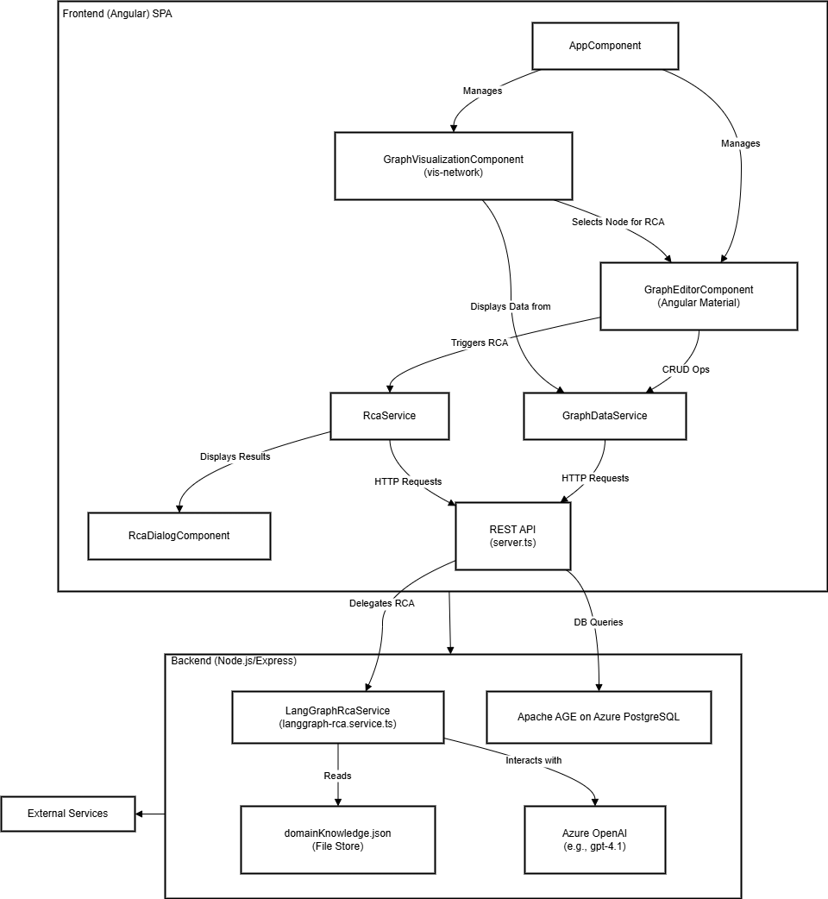

# LangGraphRefineryDiagnostics: Apache AGE UI with LangGraph-Powered RCA

**LangGraphRefineryDiagnostics** is an Angular-based web application designed to provide a
user-friendly interface for interacting with graph data stored in an Apache AGE
enabled tailored for Azure PostgreSQL database. It allows users to
visualize, create, read, update, and delete (CRUD) graph nodes and
relationships. A key enhancement is the advanced Root Cause Analysis (RCA)
feature, powered by **LangGraph** and Azure OpenAI. This enables users to gain
deeper insights from their graph data, particularly for **failure analysis and
sulfur detection scenarios**, by leveraging LLM capabilities. The RCA process is
now significantly more sophisticated, incorporating domain-specific knowledge
from a `domainKnowledge.json` file and utilizing a highly structured and
detailed prompt to guide the LLM. This results in more accurate, context-aware,
and actionable insights. The application features an interactive graph
visualization, an editor panel for data manipulation, and search functionality.

## Table of Contents

* [High-Level Overview](#high-level-overview)
* [Key Features](#key-features)
* [Technology Stack](#technology-stack)
* [Application Architecture](#application-architecture)
  * [Architecture Diagram (Mermaid)](#architecture-diagram)
* [Application Flow](#application-flow)
  * [Data Fetching and Initial Visualization](#data-fetching-and-initial-visualization)
  * [CRUD Operations Flow](#crud-operations-flow)
  * [Search Functionality Flow](#search-functionality-flow)
  * [Editor and Visualization Interaction (Populating Forms on Click)](#editor-and-visualization-interaction-populating-forms-on-click)
  * [Root Cause Analysis (RCA) Flow with LangGraph](#root-cause-analysis-rca-flow-with-langgraph)
* [API Endpoints](#api-endpoints)
  * [Node CRUD API Endpoints](#node-crud-api-endpoints)
  * [Edge CRUD API Endpoints](#edge-crud-api-endpoints)
  * [Search API Endpoint](#search-api-endpoint)
  * [RCA API Endpoint](#rca-api-endpoint)
* [Current Development Status](#current-development-status)
* [Component-wise Explanation](#component-wise-explanation)
  * [Angular Frontend Components](#angular-frontend-components)
    * [`AppComponent`](#appcomponent-srcappappcomponentts-html-css)
    * [`GraphVisualizationComponent`](#graphvisualizationcomponent-srcappcomponentsgraph-visualization)
    * [`GraphEditorComponent`](#grapheditorcomponent-srcappcomponentsgraph-editor)
    * [`RcaDialogComponent`](#rcadialogcomponent-srcappcomponentsrca-dialog)
  * [Angular Frontend Services](#angular-frontend-services)
    * [`GraphDataService`](#graphdataservice-srcappservicesgraph-dataservicets)
    * [`RcaService`](#rcaservice-srcappservicesrcaservicets)
  * [Node.js Backend](#nodejs-backend)
    * [Main Server (`server.ts`)](#main-server-serverts)
    * [LangGraph RCA Service (`langgraph-rca.service.ts`)](#langgraph-rca-service-langgraph-rcaservicets)
* [Project Directory Structure](#project-directory-structure)
  * [`backend/src/domainKnowledge.json`](#domainknowledgejson)
* [Core Libraries Used](#core-libraries-used)
* [Setup Instructions](#setup-instructions)
  * [Prerequisites](#prerequisites)
  * [Backend Setup](#backend-setup-backend-directory)
  * [Frontend Setup](#frontend-setup-root-project-directory-pg-graph)
  * [Database Setup](#database-setup-apache-age-on-age-enabled-azure-postgresql)
  * [Domain Knowledge File Setup](#domain-knowledge-file-setup)
* [How to Run the Application](#how-to-run-the-application)
* [Building the Project](#building-the-project)
* [Running Unit Tests](#running-unit-tests)
* [Contributing](#contributing)
* [License](#license)

## High-Level Overview

LangGraphRefineryDiagnostics is an Angular-based web application designed to provide a
user-friendly interface for interacting with graph data stored in Azure
PostgreSQL with the AGE (Apache Graph Extension) extension. This application
allows users to visualize graph structures, perform Create, Read, Update, and
Delete (CRUD) operations on nodes and relationships, and search for specific
graph elements. It now incorporates an advanced Root Cause Analysis (RCA)
capability using **LangGraph**. This RCA is significantly enhanced by:
*   **Domain-Specific Knowledge**: Dynamically injecting relevant information from a `domainKnowledge.json` file (containing details about refinery components, failure modes, sulfur monitoring, and critical checkpoints) into the LLM prompt.
*   **Structured LLM Interaction**: Utilizing a meticulously crafted prompt template that provides comprehensive context, defines the required analysis framework, and enforces a strict, detailed JSON output structure for the `RcaResult`. This structure now includes comprehensive sections such as `sulfur_assessment`, `process_evaluation`, `identified_failure_modes` (with detailed `contributing_factors` and `mitigation_strategies` as objects), `performance_predictions`, `regulatory_compliance`, and `data_confidence`.
This approach ensures the LLM generates more accurate, relevant, and structured insights, particularly for **failure and sulfur detection** in industrial process graphs.

## Key Features

* **Interactive Graph Visualization**: Uses `vis-network` to render and interact
  with graph data.
* **CRUD Operations**: Full support for creating, reading, updating, and
  deleting nodes and edges with their properties.
* **Property Editor**: A dedicated panel to view and modify the properties of
  selected nodes and edges.
* **Search Functionality**: Allows users to search for nodes and edges based on
  labels or property values.
* **Advanced Root Cause Analysis (RCA) with LangGraph**: Integrates with Azure
  OpenAI (e.g., gpt-4.1) via a **LangGraph**-orchestrated backend process. This
  provides AI-driven analysis of selected nodes and their local graph
  neighborhood to suggest potential root causes or insights.
  * **Domain-Aware Analysis**: The RCA process is enriched by `domainKnowledge.json`, providing the LLM with specific details about refinery components, common failure modes, sulfur monitoring protocols, and critical checkpoints relevant to the analyzed node.
  * **Structured and Detailed Prompts**: Employs a sophisticated prompt engineering strategy, ensuring the LLM receives comprehensive context, including system context, input parameters, a required analysis framework, and the expected detailed JSON output structure (`RcaResult`). This detailed structure now encompasses fields like `analysis_id`, `analyzed_node_id`, `analysis_summary`, `sulfur_assessment`, `process_evaluation`, `root_cause_analysis` (which includes `identified_failure_modes` with object-based `contributing_factors` and `mitigation_strategies`), `immediate_actions`, `recommendations`, `performance_predictions`, `regulatory_compliance`, and `data_confidence`, leading to more reliable and actionable results, especially for **failure analysis and sulfur detection**.
* **Real-time Updates**: The graph visualization refreshes automatically after
  CRUD operations.
* **Backend API**: A Node.js/Express backend that communicates with Apache AGE
  on Azure PostgreSQL and orchestrates RCA with LangGraph.

## Technology Stack

* **Frontend**: Angular, Angular Material, vis-network
* **Backend**: Node.js, Express.js, pg (node-postgres), **LangChain.js (with LangGraph)**
* **Database**: Apache AGE on Azure PostgreSQL
* **AI Integration**: Azure OpenAI (e.g., gpt-4.1)
* **Domain Knowledge Store**: `domainKnowledge.json` (for RCA enhancement)

## Application Architecture

The application follows a typical client-server architecture:

### Frontend (Angular)

* **Framework**: Angular (TypeScript)
* **UI Components**: Angular Material for a consistent look and feel.
* **Graph Visualization**: `vis-network` library for rendering interactive graph
  diagrams.
* **Responsibilities**:
  * Presenting the user interface.
  * Handling user interactions (form submissions, clicks on the graph).
  * Making API calls to the backend to fetch or modify graph data.
  * Displaying graph data visually.
  * Managing client-side state.

### Backend (Node.js/Express)

* **Framework**: Node.js with Express.js (TypeScript)
* **Database Driver**: `pg` (node-postgres) for connecting to the AGE enabled
  Azure PostgreSQL database.
* **Responsibilities**:
  * Providing a RESTful API for the frontend to consume.
  * Connecting to the AGE enabled Azure PostgreSQL database.
  * Translating API requests into Cypher queries (for Apache AGE).
  * Executing queries against the database and returning results.
  * Handling business logic related to graph data manipulation.
  * Managing database connections.

### Database (AGE enabled Azure PostgreSQL)

* **Type**: Relational Database (AGE enabled Azure PostgreSQL) extended with
  Graph Database capabilities (Apache AGE).
* **Query Language**: SQL and Cypher (for graph operations via Apache AGE).
* **Responsibilities**:
  * Persistently storing graph data (nodes and relationships with their
    properties).
  * Executing Cypher queries to create, read, update, and delete graph
    elements.
  * Ensuring data integrity and consistency.

### Architecture Diagram




(The diagram above illustrates the architecture)

## Application Flow

### Data Fetching and Initial Visualization

1. **App Initialization**: When the Angular application loads, `AppComponent` is
   the root.
2. **Visualization Component**: `GraphVisualizationComponent` is responsible for
   displaying the graph.
3. **Service Request**: On initialization (`ngOnInit`),
   `GraphVisualizationComponent` calls `GraphDataService.getGraphData()`.
4. **API Call**: `GraphDataService` makes an HTTP GET request to the backend API
   endpoint (e.g., `/api/graph`).
5. **Backend Processing**: The backend server receives the request, queries the
   Apache AGE database for all nodes and edges.
   * It typically executes Cypher queries like `MATCH (n) RETURN n;` and
     `MATCH ()-[r]->() RETURN r;`.
   * The results are formatted into a structure containing `nodes` and `edges`
     arrays (e.g., `{ nodes: [...], edges: [...] }`).
6. **API Response**: The backend sends the graph data back to the frontend as a
   JSON response.
7. **Service Receives Data**: `GraphDataService` receives the response and
   passes it to `GraphVisualizationComponent`.
8. **Graph Rendering**: `GraphVisualizationComponent` uses the received data to
   instantiate and render the graph using the `vis-network` library.

### CRUD Operations Flow

When a user performs a CRUD (Create, Read, Update, Delete) operation:

1. **UI Interaction (`GraphEditorComponent`)**:
   * The user interacts with forms or buttons in `GraphEditorComponent` (or
     future dedicated components).
   * This component captures data (e.g., new node's label, properties; ID of a
     node to update/delete).
2. **Service Call (`GraphDataService`)**:
   * The UI component calls a method in `GraphDataService` (e.g.,
     `createNode()`, `updateNode()`, `deleteNode()`, `createEdge()`).
3. **HTTP Request to Backend**:
   * `GraphDataService` sends an HTTP request (e.g., `POST` for create, `PUT`
     for update, `DELETE` for delete) to the backend API (e.g., `/api/node`,
     `/api/node/:id`, `/api/edge`).
4. **Backend API Processing (`backend/src/server.ts`)**:
   * The backend API receives the request.
   * The route handler parses the request and constructs the appropriate Cypher
     query.
   * Example (Create Node): `CREATE (:NewLabel {prop1: 'value1'});`
   * Example (Update Node):
     `MATCH (n) WHERE id(n) = <node_id> SET n.label = 'NewLabel', n.prop1 = 'new_value';`
   * The query is executed against Apache AGE.
5. **Database Operation**: Apache AGE modifies the graph data.
6. **Backend Response**: The backend API sends a response (e.g., the
   created/updated element, or a success message).
   * For `DELETE /api/node/:id`, the backend returns
     `{ message: string, deletedNodeId: string }`.
7. **Service Receives Response**: `GraphDataService` gets the response.
8. **UI Update & Feedback**:
   * The UI component receives data/confirmation.
   * `AppComponent` then calls a method on `GraphVisualizationComponent` (e.g.,
     `refreshGraphData()`) to re-fetch the entire graph, ensuring the
     visualization is up-to-date.

### Search Functionality Flow

1. **User Input (`GraphEditorComponent`)**: The user enters search criteria
   (e.g., node label, property value) in the `GraphEditorComponent`.
2. **Event Emission**: `GraphEditorComponent` emits a `searchSubmitted` event
   with the search query.
3. **`AppComponent` Handling**: `AppComponent` listens for this event and calls
   a method on `GraphVisualizationComponent`, passing the search query.
4. **Service Request (`GraphVisualizationComponent` -> `GraphDataService`)**:
   `GraphVisualizationComponent` (or `GraphDataService` directly) makes an API
   call to a search endpoint (e.g., `GET /api/search?query=...`).
5. **Backend Search Processing**: The backend API receives the search query.
   * It constructs a Cypher query to find matching nodes/edges.
   * Example:
     `MATCH (n) WHERE n.name CONTAINS 'search_term' OR n.label = 'search_term' RETURN n;`
6. **API Response**: The backend returns the search results (a subset of the
   graph or relevant data).
7. **Display Results**: `GraphVisualizationComponent` updates its display to
   highlight or filter based on the search results. (This part may involve
   re-rendering or using `vis-network`'s filtering capabilities).

### Editor and Visualization Interaction (Populating Forms on Click)

This allows users to click a node/edge in the visualization and see its details
in the editor:

1. **Click Event (`GraphVisualizationComponent`)**:
   * User clicks a node/edge in the `vis-network` canvas.
   * `GraphVisualizationComponent`'s click handler identifies the clicked
     element.
   * It emits `nodeClicked` or `edgeClicked` event with the `VisNode` or
     `VisEdge` object.
2. **Event Handling (`AppComponent`)**:
   * `AppComponent` listens for these events.
   * Its handler (e.g., `handleNodeClicked()`) updates `selectedNodeForEditor`
     or `selectedEdgeForEditor` properties.
3. **Input Binding to `GraphEditorComponent`**:
   * `AppComponent` passes `selectedNodeForEditor` and `selectedEdgeForEditor`
     to `GraphEditorComponent` via input bindings (`[selectedNode]`,
     `[selectedEdge]`).
4. **`OnChanges` in `GraphEditorComponent`**:
   * `GraphEditorComponent.ngOnChanges()` is triggered when its input properties
     change.
   * It populates the editor form fields (node ID, label, properties, or edge
     ID, label, properties, from/to) based on the received `selectedNode` or
     `selectedEdge`.
5. **Manual Fetch Option**:
   * `GraphEditorComponent` also allows users to type an ID into
     "Node ID to Select" or "Edge ID to Select" fields.
   * Clicking "Fetch Details" calls `selectNodeForUpdate()` or
     `selectEdgeForUpdate()`.
   * These methods use `GraphDataService.getNode(id)` or
     `GraphDataService.getEdge(id)` to fetch details from the backend.
   * The fetched data then updates the component's internal reference to the
     selected node or edge, and the component directly populates the form
     fields with this data.

### Root Cause Analysis (RCA) Flow with LangGraph

1.  **User Interaction (`GraphEditorComponent`)**:
    *   The user selects a node in the graph visualization.
    *   The user clicks the "Analyze Root Cause" button in the `GraphEditorComponent`.
2.  **Service Call (Frontend `RcaService`)**:
    *   `GraphEditorComponent` calls `RcaService.performRca(selectedNodeData)`.
    *   `RcaService` constructs the necessary input for the backend, which includes the node ID and its properties.
3.  **HTTP Request to Backend**:
    *   `RcaService` (via `GraphDataService` or directly) sends an HTTP `POST` request to the backend API endpoint (e.g., `/api/rca`). The request body includes the selected node's ID and data.
4.  **Backend API Processing (`backend/src/server.ts` -> `backend/src/langgraph-rca.service.ts`)**:
    *   The main backend API (`server.ts`) receives the request and delegates it to the `LangGraphRcaService`.
    *   The `LangGraphRcaService` orchestrates the RCA process:
        *   **Fetching Context**: Retrieves the neighborhood (connected nodes and edges up to a certain depth) of the selected node from the Apache AGE database.
        *   **Loading Domain Knowledge**: Reads and parses `domainKnowledge.json` to make domain-specific information available.
        *   **Prompt Engineering**: Constructs a highly detailed and structured prompt for an LLM (Azure OpenAI). This prompt includes:
            *   A "System Context" defining the AI's role as a refinery domain expert.
            *   "Input Parameters for this Analysis" (dynamically filled with selected node data, adjacent nodes, and connecting edges).
            *   A "Required Analysis Framework" guiding the LLM on how to structure its analysis.
            *   The strict, detailed `RcaResult` JSON output schema that the LLM must adhere to. This schema now defines comprehensive sections like `sulfur_assessment`, `process_evaluation`, `identified_failure_modes` (where `contributing_factors` and `mitigation_strategies` are arrays of detailed objects), `performance_predictions`, `regulatory_compliance`, and `data_confidence`.
            *   Dynamically injected domain-specific knowledge (common failure modes, sulfur monitoring details, critical checkpoints) relevant to the selected node's type, extracted from `domainKnowledge.json`.
            *   Comprehensive few-shot examples illustrating the desired output format and content.
        *   **LLM Interaction**: Sends the meticulously crafted prompt to Azure OpenAI.
        *   **State Management**: LangGraph manages the state as data flows through various processing nodes (fetching, analysis, summarization).
        *   **Response Generation**: Parses the LLM's JSON response. If parsing fails or the LLM returns an error, it's handled gracefully, and an error structure is returned.
5.  **Azure OpenAI Service**:
    *   The LLM (e.g., gpt-4.1) processes the detailed prompt and returns a JSON string conforming to the comprehensive `RcaResult` structure.
6.  **Backend Response**:
    *   The `LangGraphRcaService` compiles the results from the LangGraph execution.
    *   The main backend API sends a JSON response back to the frontend, containing the detailed and structured RCA results as defined by the updated `RcaResult` interface.
7.  **Service Receives Response (Frontend `RcaService`)**:
    *   The frontend `RcaService` receives the structured and detailed RCA data.
8.  **Display in Dialog (`RcaDialogComponent`)**:
    *   `RcaService` (or `GraphEditorComponent` that initiated the call) triggers the opening of `RcaDialogComponent`.
    *   The comprehensive RCA results are passed to `RcaDialogComponent`.
    *   `RcaDialogComponent` displays the detailed analysis to the user in an organized manner, leveraging the new fields and structures (e.g., expansion panels for failure modes, detailed contributing factors, mitigation strategies, sulfur assessments, etc.).

## API Endpoints

### Node CRUD API Endpoints

The backend (`backend/src/server.ts`) provides the following RESTful API
endpoints for managing nodes:

* **Create Node:** `POST /api/node`
  * **Request Body:** JSON object representing the node to create.

    ```json
    {
      "label": "WorkOrder",
      "properties": {
        "work_order_id": "WO12345",
        "status": "Open",
        "description": "Routine maintenance check"
      }
    }
    ```

  * **Response Body:** JSON object of the created node, including its
    auto-generated graph ID.

    ```json
    {
      "id": "10133099161583620",
      "label": "WorkOrder",
      "properties": {
        "work_order_id": "WO12345",
        "status": "Open",
        "description": "Routine maintenance check"
      }
    }
    ```

  * **Angular Service Method:**
    `GraphDataService.createNode(nodeData: Omit<VisNode, 'id'>)`
  * **Backend Handler:** `createNodeHandler`

* **Read Node:** `GET /api/node/:id`
  * **URL Parameter:** `:id` - The graph ID of the node to retrieve.
  * **Response Body:** JSON object of the requested node.

    ```json
    {
      "id": "10133099161583620",
      "label": "WorkOrder",
      "properties": { }
    }
    ```

  * **Angular Service Method:** `GraphDataService.getNode(id: string | number)`
  * **Backend Handler:** `getNodeByIdHandler`

* **Update Node:** `PUT /api/node/:id`
  * **URL Parameter:** `:id` - The graph ID of the node to update.
  * **Request Body:** JSON object with properties to update. Can include `label`
    and/or `properties`.

    ```javascript
    {
      "label": "UpdatedWorkOrderLabel",
      "properties": {
        "status": "Closed",
        "resolution": "Completed successfully"
      }
    }
    ```

  * **Response Body:** JSON object of the updated node.
  * **Angular Service Method:**
    `GraphDataService.updateNode(id: string | number, nodeData: Partial<VisNode>)`
  * **Backend Handler:** `updateNodeHandler`

* **Delete Node:** `DELETE /api/node/:id`
  * **URL Parameter:** `:id` - The graph ID of the node to delete.
  * **Response Body:** JSON object confirming deletion.

    ```json
    {
      "message": "Node deleted successfully",
      "deletedNodeId": "10133099161583620"
    }
    ```

  * **Angular Service Method:** `GraphDataService.deleteNode(id: string | number)`
  * **Backend Handler:** `deleteNodeHandler`

### Edge CRUD API Endpoints

> **Note:** While the API endpoints and corresponding service methods for Edge
> CRUD operations are implemented, they are pending comprehensive end-to-end
> testing. Please refer to the 'Current Development Status' section for more
> details.

The backend (`backend/src/server.ts`) provides the following RESTful API
endpoints for managing edges. Note that edge IDs are also string representations
of their internal numeric AGE IDs, similar to nodes.

* **Create Edge:** `POST /api/edge`
  * **Request Body:** JSON object representing the edge to create.

    ```javascript
    // 'from' and 'to' fields expect the stringified internal numeric graph IDs
    // of the source and target nodes.
    {
      "from": "10133099161583618",
      "to": "10133099161583620",
      "label": "RELATED_TO",
      "properties": {
        "relationship_type": "dependency",
        "strength": 0.75
      }
    }
    ```

  * **Response Body:** JSON object of the created edge, including its
    auto-generated graph ID (stringified internal numeric ID).

    ```javascript
    // - "id" is the stringified internal numeric graph ID of the created edge.
    // - "label" (at the root) is the actual agtype label (type) of the edge.
    // - "title" typically holds a stringified version of properties for display
    //   in tooltips.
    // - A "label" field within "properties" would be a user-defined property,
    //   distinct from the agtype edge label.
    {
      "id": "11258999068426243",
      "from": "10133099161583618",
      "to": "10133099161583620",
      "label": "RELATED_TO",
      "title": "{\\n  \\"relationship_type\\": \\"dependency\\",\\n  \\"strength\\": 0.75\\n}",
      "properties": {
        "relationship_type": "dependency",
        "strength": 0.75
      }
    }
    ```

* **Read Edge:** `GET /api/edge/:id`
  * **URL Parameter:** `:id` - The graph ID of the edge to retrieve
    (stringified internal numeric ID, e.g., "11258999068426243").
  * **Response Body:** JSON object of the requested edge.

    ```javascript
    {
      "id": "11258999068426243",
      "from": "10133099161583618",
      "to": "10133099161583620",
      "label": "RELATED_TO",
      "properties": { /* ... */ }
    }
    ```

* **Update Edge:** `PUT /api/edge/:id`
  * **URL Parameter:** `:id` - The graph ID of the edge to update (stringified
    internal numeric ID).
  * **Request Body:** JSON object with properties to update.
    *Note: To change the edge's fundamental `label` (its type in AGE), you
    typically delete and recreate the edge with the new label. The `properties`
    can include a `label` field for display purposes, but this won't change the
    underlying AGE edge type if you are just updating properties.*

    ```javascript
    // The "label" field within "properties" updates a display label,
    // not the underlying agtype (graph) label of the edge.
    {
      "properties": {
        "strength": 0.95,
        "status": "verified",
        "label": "Updated Display Label"
      }
    }
    ```

* **Delete Edge:** `DELETE /api/edge/:id`
  * **URL Parameter:** `:id` - The graph ID of the edge to delete (stringified
    internal numeric ID).
  * **Response Body:** JSON object confirming deletion.

    ```javascript
    {
      "message": "Edge deleted successfully",
      "id": "11258999068426243"
    }
    ```

### Search API Endpoint

* **Search Graph:** `GET /api/search`
  * **Query Parameters:** `?label=<label>&propertyKey=<key>&propertyValue=<value>`
    (example, actual params may vary)
* **Search**: UI for search submission is present. Backend search logic and
  frontend result display are functional.

### RCA API Endpoint

<!-- Note: overall_confidence_score is a string, e.g., "0.75" for 75% -->
<!-- Note: error_details will contain an RcaError object if an error occurred during analysis -->
* `POST /api/rca`
  * **Description:** Performs Root Cause Analysis on a given node using LangGraph and Azure OpenAI, incorporating domain-specific knowledge. The analysis results in a detailed, structured JSON output.
  * **Request Body:** JSON object containing information about the node to be analyzed. Example:
    ```json
    {
      "analysis_id": "unique-analysis-uuid",
      "analyzed_node_id": "node_123",
      "analysis_summary": "Analysis of node 123",
      "sulfur_assessment": {
        "sulfur_level": 0.05,
        "sulfur_sources": ["Source A", "Source B"],
        "sulfur_mitigation_strategies": ["Strategy 1", "Strategy 2"]
      },
      "process_evaluation": {
        "process_id": "process_001",
        "process_description": "Evaluation of process 001",
        "process_performance": "Optimal"
      },
      "identified_failure_modes": {
        "failure_modes": [
          {
            "failure_mode_id": "fm_001",
            "failure_mode_description": "Pipe Corrosion",
            "likelihood_score": 0.7,
            "impact_score": 0.9,
            "contributing_factors": [
              {
                "factor_id": "cf_001a",
                "factor_description": "High sulfur content in feedstock",
                "evidence": ["Lab report XYZ", "Sensor data ABC"]
              }
            ],
            "mitigation_strategies": [
              {
                "strategy_id": "ms_001a",
                "strategy_description": "Implement enhanced feedstock filtering",
                "effectiveness_rating": 0.8,
                "implementation_priority": "High"
              }
            ]
          }
        ]
      },
      "performance_predictions": {
        "prediction_id": "pred_001",
        "prediction_description": "Performance prediction for node 123",
        "predicted_performance": "Stable"
      },
      "regulatory_compliance": {
        "compliance_id": "comp_001",
        "compliance_description": "Compliance with regulation XYZ",
        "compliance_status": "Compliant"
      },
      "data_confidence": {
        "overall_confidence_score": "0.85",
        "confidence_assessment_details": "Confidence is high based on available sensor data and maintenance logs.",
        "data_gaps": ["Real-time corrosion sensor data missing for Pipe B"],
        "uncertainty_factors": ["Variability in feedstock quality"]
      },
      "error_details": null
    }
    ```
  * **Response Body (Error):** If an error occurs during RCA, the `error_details` field in the `RcaResult` object (shown above) will be populated. In case of other server-side issues, a standard error response (e.g., 500 Internal Server Error) might be returned.

## Current Development Status

* **Node CRUD**: Fully implemented and tested.
* **Edge CRUD**: Implemented, pending comprehensive end-to-end testing.
* **Search**: UI for search submission is present. Backend search logic and
  frontend result display are functional.
* **Root Cause Analysis (RCA) with LangGraph**:
  * Backend endpoint `/api/rca` implemented, utilizing `langgraph-rca.service.ts`
    to fetch node neighborhood context and orchestrate analysis with Azure OpenAI
    via a LangGraph. The response from this endpoint is now a comprehensive JSON object adhering to the detailed `RcaResult` structure.
  * Frontend `RcaDialogComponent` displays detailed, structured analysis results, including new sections like sulfur assessment, process evaluation, performance predictions, and detailed contributing factors/mitigation strategies.
  * Integration with `GraphDataService` and `RcaService` to call the backend and
    manage data flow.

## Component-wise Explanation

### Angular Frontend Components

#### `AppComponent` (`src/app/app.component.ts`, `.html`, `.css`)

* **Role**: The root component of the Angular application. It acts as the main
  container for other components.
* **Responsibilities**:
  * Sets up the main layout, including the toolbar.
  * Hosts the `GraphEditorComponent` and the `GraphVisualizationComponent` (via
    `<router-outlet>`).
  * Manages the interaction between the editor and visualization components.
    * Handles `nodeClicked` and `edgeClicked` events from
      `GraphVisualizationComponent` to update `selectedNodeForEditor` and
      `selectedEdgeForEditor`.
    * Passes these selected items as inputs to `GraphEditorComponent`.
    * Handles `graphChanged` events from `GraphEditorComponent` to trigger a
      refresh in `GraphVisualizationComponent`.
    * Handles `searchSubmitted` events from `GraphEditorComponent` and passes
      the query to `GraphVisualizationComponent`.
* **Key Properties**:
  * `title`: For the application toolbar.
  * `selectedNodeForEditor`: Holds the node currently selected for editing.
  * `selectedEdgeForEditor`: Holds the edge currently selected for editing.
* **Key Methods**:
  * `handleNodeClicked()`: Updates `selectedNodeForEditor` when a node is
    clicked in the visualization.
  * `handleEdgeClicked()`: Updates `selectedEdgeForEditor` when an edge is
    clicked.
  * `handleGraphChanged()`: Triggers a data refresh in the visualization
    component.
  * `handleSearchSubmitted()`: Relays search queries.

#### `GraphVisualizationComponent` (`src/app/components/graph-visualization/`)

* **Role**: Responsible for rendering and interacting with the graph
  visualization.
* **Responsibilities**:
  * Fetching the initial graph data from `GraphDataService`
  * Initializing and configuring the `vis-network` instance.
  * Rendering nodes and edges on an HTML5 canvas.
  * Handling user interactions within the graph (e.g., clicks, drags, zoom).
  * Emitting `nodeClicked` and `edgeClicked` events when graph elements are
    selected by the user.
  * Providing a `refreshGraphData()` method that can be called externally (e.g.,
    by `AppComponent`) to re-fetch and re-render the graph.
  * (Future) Displaying search results by highlighting or filtering nodes/edges.
* **Key Properties**:
  * `visNetworkContainer`: An `ElementRef` pointing to the `div` where
    `vis-network` will render the graph.
  * `networkInstance`: The `vis-network` Network object.
  * `graphData`: Stores the current nodes and edges being displayed.
  * `nodeClicked`, `edgeClicked`: `EventEmitter`s for outputting selection
    events.
* **Key Methods**:
  * `ngOnInit()`: Fetches initial graph data.
  * `ngAfterViewInit()`: Initializes the `vis-network` instance once the view is
    ready.
  * Event handlers for `vis-network` click events.

#### `GraphEditorComponent` (`src/app/components/graph-editor/`)

* **Role**: Provides UI forms for creating, updating, deleting, and searching
  graph nodes and edges.
* **Responsibilities**:
  * Displaying forms for node properties (ID, label, JSON properties).
  * Displaying forms for edge properties (ID, label, from/to, JSON properties).
  * Handling form submissions for CRUD operations and calling the appropriate
    `GraphDataService` methods.
  * Emitting a `graphChanged` event after successful CUD operations to notify
    `AppComponent` to refresh the visualization.
  * Allowing users to fetch node/edge details by ID for editing.
  * Populating forms when `selectedNode` or `selectedEdge` inputs change (due
    to clicks in the visualization).
  * Handling search form submission and emitting a `searchSubmitted` event with
    the query.
* **Key Properties (Inputs)**:
  * `selectedNode`: The node selected in the visualization, passed from
    `AppComponent`.
  * `selectedEdge`: The edge selected in the visualization, passed from
    `AppComponent`.
* **Key Properties (Outputs)**:
  * `graphChanged`: `EventEmitter` to signal that the graph data has been
    modified.
  * `searchSubmitted`: `EventEmitter` to pass search queries to `AppComponent`.
* **Key Methods**:
  * `ngOnChanges()`: Detects changes to `selectedNode`/`selectedEdge` and
    populates forms.
  * Form submission handlers (e.g., `onCreateNode()`, `onUpdateNode()`,
    `onDeleteNode()`).
  * `selectNodeForUpdate()` / `selectEdgeForUpdate()`: Fetches node/edge by ID.
  * `onSearch()`: Emits the search query.

#### `RcaDialogComponent` (`src/app/components/rca-dialog/`)

*   **Role**: Displays the results of the Root Cause Analysis in a modal dialog.
*   **Responsibilities**:
    *   Receives comprehensive RCA data (as defined by the updated `RcaResult` model, including detailed failure modes with object-based contributing factors and mitigation strategies, sulfur assessments, process evaluations, performance predictions, regulatory compliance information, and data confidence scores) as input.
    *   Presents the information in a structured and readable format, often using Angular Material components like cards and expansion panels to accommodate the new detailed sections.
    *   Handles cases where RCA data might be partially available or if an error occurred during the analysis.
    *   Provides a "Close" button to dismiss the dialog.
    *   Ensures text wraps correctly for long descriptions and lists.

### Angular Frontend Services

#### `GraphDataService` (`src/app/services/graph-data.service.ts`)

*   **Role**: Central service for all backend API interactions related to graph data (nodes, edges, general graph operations, search).
*   **Responsibilities**:
    *   Fetching the entire graph (`getGraphData`).
    *   CRUD operations for nodes (`getNode`, `createNode`, `updateNode`, `deleteNode`).
    *   CRUD operations for edges (`getEdge`, `createEdge`, `updateEdge`, `deleteEdge`).
    *   Performing graph search (`searchGraph`).
    *   Notifying components (like `GraphVisualizationComponent`) when the graph data needs to be refreshed (e.g., after a CUD operation) using an RxJS Subject/Observable (`graphRefreshNeeded$`).
    *   Managing the currently selected node and edge (`selectedNode$`, `selectedEdge$`) and providing methods to update them.
*   **Key Methods**: All methods performing HTTP requests to the backend API endpoints for graph data.
*   **Key Observables**: `graphRefreshNeeded$`, `selectedNode$`, `selectedEdge$`.

#### `RcaService` (`src/app/services/rca.service.ts`)

*   **Role**: Dedicated service for handling Root Cause Analysis (RCA) requests.
*   **Responsibilities**:
    *   Provides a method (`performRca`) that takes RCA input (e.g., `RcaObservationInput`).
    *   Makes an HTTP POST request to the backend's `/api/rca` endpoint.
    *   Returns an Observable with the structured and detailed RCA results (conforming to the updated `RcaResult` model) from the backend.
    *   Handles potential errors from the RCA API call.
*   **Key Methods**:

### Node.js Backend

#### Main Server (`backend/src/server.ts`)

*   **Role**: The main Express.js application file.
*   **Responsibilities**:
    *   Sets up the Express server, including middleware (CORS, body parsing).
    *   Defines all RESTful API routes for nodes, edges, search, and RCA.
    *   Connects to the Azure PostgreSQL database with Apache AGE extension.
    *   Handles incoming HTTP requests, calls appropriate handlers/service functions.
    *   For RCA requests, it primarily acts as a gateway, validating input and then delegating the core logic to the `LangGraphRcaService`.
    *   Formats and sends HTTP responses.
*   **Key Route Handlers**: `createNodeHandler`, `getNodeByIdHandler`, `updateNodeHandler`, `deleteNodeHandler`, `createEdgeHandler`, `getEdgeByIdHandler`, `updateEdgeHandler`, `deleteEdgeHandler`, `searchGraphHandler`, `newAnalyzeRootCauseHandler` (which uses `LangGraphRcaService`).

#### LangGraph RCA Service (`backend/src/langgraph-rca.service.ts`)

*   **Role**: Orchestrates the Root Cause Analysis process using LangGraph.
*   **Responsibilities**:
    *   Defines and compiles a LangGraph state machine/graph.
    *   Receives input (e.g., node ID, observation data) from the main server's RCA route handler.
    *   Executes the LangGraph, which involves:
        *   Fetching detailed information about the target node and its neighborhood from the Apache AGE database.
        *   Dynamically constructing prompts for an LLM (Azure OpenAI) based on the graph context and the analysis goal.
        *   Interacting with the Azure OpenAI API.
        *   Processing LLM responses.
        *   Managing the flow of data and state through the LangGraph.
    *   **Loads and utilizes `domainKnowledge.json`**: This file contains structured information about refinery components, their common failure modes, sulfur monitoring details, and critical operational checkpoints. The service uses helper functions (`findComponentKnowledge`, `formatSulfurMonitoringForPrompt`, `formatCriticalCheckpointsForPrompt`) to extract and format relevant pieces of this knowledge.
    *   **Constructs and sends detailed, structured prompts to Azure OpenAI**: The `analyzeData` method dynamically builds a sophisticated prompt that includes:
        * System context (defining the AI's expert role).
        * Input parameters (selected node, neighbors, edges).
        * A specific "Required Analysis Framework" to guide the LLM's reasoning process.
        * The strict, detailed `RcaResult` JSON output schema, now including comprehensive sections like `sulfur_assessment`, `process_evaluation`, `identified_failure_modes` (with `contributing_factors` and `mitigation_strategies` as arrays of detailed objects), `performance_predictions`, `regulatory_compliance`, and `data_confidence`.
        * Relevant domain knowledge (failure modes, sulfur info, checkpoints) based on the selected node's type, injected from `domainKnowledge.json`.
        * Updated few-shot examples to guide the LLM towards the desired output format and quality.
    *   Parses the LLM's JSON response, ensuring it conforms to the updated `RcaResult` interface.
    *   Handles potential errors during LLM interaction or JSON parsing, returning a structured error within the `RcaResult` object.
*   **Key Methods**:

## Project Directory Structure

```
pg-graph/
├── backend/
│   ├── src/
│   │   ├── langgraph-rca.service.ts  # LangGraph RCA orchestration
│   │   ├── domainKnowledge.json      # Stores domain-specific knowledge for RCA
│   │   ├── server.ts                 # Node.js/Express backend server
│   │   ├── bundle.pem                # SSL certificate bundle for Azure DB
│   │   ├── DigiCertGlobalRootCA.crt
│   │   ├── DigiCertGlobalRootG2.crt.pem
│   │   └── MicrosoftRSARootCertificateAuthority2017.crt
│   ├── package.json
│   └── tsconfig.json
├── public/
│   └── favicon.ico
├── src/
│   ├── app/
│   │   ├── components/
│   │   │   ├── graph-editor/         # Angular component for graph editing UI
│   │   │   │   ├── graph-editor.component.ts
│   │   │   │   ├── graph-editor.component.html
│   │   │   │   └── graph-editor.component.css
│   │   │   ├── graph-visualization/  # Angular component for graph visualization
│   │   │   │   ├── graph-visualization.component.ts
│   │   │   │   ├── graph-visualization.component.html
│   │   │   │   └── graph-visualization.component.css
│   │   │   └── rca-dialog/           # Angular component for RCA results dialog
│   │   │       ├── rca-dialog.component.ts
│   │   │       ├── rca-dialog.component.html
│   │   │       └── rca-dialog.component.css
│   │   ├── models/
│   │   │   └── rca.models.ts         # TypeScript models for RCA data, updated for detailed structures
│   │   ├── services/
│   │   │   ├── graph-data.service.ts # Service for graph CRUD and search
│   │   │   └── rca.service.ts        # Service for RCA operations
│   │   ├── app.component.ts          # Root Angular component
│   │   ├── app.component.html
│   │   ├── app.component.css
│   │   ├── app.config.ts
│   │   ├── app.config.server.ts
│   │   ├── app.routes.ts
│   │   └── app.routes.server.ts
│   ├── assets/
│   │   └── images/
│   │       ├── graph.png
│   │       └── LangGraphRefineryDiagnostics.png
│   ├── index.html
│   ├── main.ts                     # Main entry point for Angular app
│   ├── main.server.ts
│   ├── server.ts                   # Entry point for Angular Universal (if used)
│   └── styles.css                  # Global styles
├── angular.json                    # Angular CLI configuration
├── package.json                    # Frontend npm dependencies and scripts
├── tsconfig.json                   # Root TypeScript configuration
├── tsconfig.app.json
├── tsconfig.spec.json
├── README.md                       # This file
└── PROJECT_DECISIONS.md            # Project decision log
```

### `domainKnowledge.json`

*   **Location**: `backend/src/domainKnowledge.json`
*   **Role**: Stores structured, domain-specific knowledge about refinery components, their failure modes, sulfur monitoring protocols, critical operational checkpoints, and other relevant details.
*   **Purpose**: This file is crucial for enhancing the Root Cause Analysis (RCA) feature. The `LangGraphRcaService` loads this data and injects relevant portions into the prompts sent to the Large Language Model (LLM). This allows the LLM to provide more accurate, context-aware, and insightful analyses by grounding its reasoning in specific domain expertise.
*   **Structure**: Typically a JSON object where keys might represent component types (e.g., "Pump", "Reactor", "SulfurRecoveryUnit") and values contain detailed information like:
    *   `commonFailureModes`: A list of known failure modes with descriptions, potential causes, and symptoms.
    *   `sulfurMonitoringDetails`: Information about how sulfur is monitored for that component or process.
    *   `criticalCheckpoints`: Key operational parameters or conditions to check.
    *   Other relevant attributes specific to the component or process.
*   **Maintenance**: This file should be curated and updated by domain experts to ensure the RCA system has the most relevant and up-to-date information.

### Core Libraries Used

*   **Frontend (Angular)**:
    *   `@angular/core`, `@angular/common`, `@angular/forms`, `@angular/platform-browser`, `@angular/router`
    *   `@angular/material`: For UI components (Dialog, Card, Button, Input, Expansion Panel, etc.).
    *   `vis-network`: For interactive graph visualization.
    *   `rxjs`: For reactive programming (Observables, Subjects).
*   **Backend (Node.js/Express)**:
    *   `express`: Web application framework.
    *   `pg`: PostgreSQL client for Node.js (to connect to Apache AGE).
    *   `cors`: Middleware for enabling CORS.
    *   `dotenv`: For managing environment variables.
    *   **`langchain`**: Core LangChain.js library.
    *   **`@langchain/openai`**: For Azure OpenAI integration.
    *   **`@langchain/langgraph`**: For building and running the RCA graph.
    *   TypeScript related: `typescript`, `@types/express`, `@types/pg`, `@types/cors`, `ts-node`, `nodemon`.
*   **Database**:
    *   Apache AGE (running on Azure PostgreSQL).

## Setup Instructions

### Prerequisites

*   Node.js and npm (Node Package Manager)
*   Angular CLI (`npm install -g @angular/cli`)
*   Access to an Azure PostgreSQL instance with the Apache AGE extension enabled and configured.
*   Azure OpenAI API Key and Endpoint, configured for a model like GPT-4 or similar.
*   Git (for cloning the repository).

### Backend Setup (`backend/` directory)

1. Navigate to the `backend` directory:
   `cd backend`

2. Install dependencies:

   ```bash
   npm install
   ```

3. Create a `.env` file in the `backend` directory with your database and
   Azure OpenAI credentials:

   ```env
   # PostgreSQL Connection Details
   PG_USER=your_db_user
   PG_HOST=your_db_host.postgres.database.azure.com
   PG_DATABASE=your_db_name
   PG_PASSWORD=your_db_password
   PG_PORT=5432
   PG_SSL_CA_PATH=src/DigiCertGlobalRootCA.crt # Or your specific CA cert path

   # Azure OpenAI Configuration
   AZURE_OPENAI_ENDPOINT=https://your-aoai-resource.openai.azure.com/
   AZURE_OPENAI_KEY=your_aoai_key
   AZURE_OPENAI_DEPLOYMENT_NAME=your_gpt_deployment_name
   ```

   * Ensure the SSL certificate (`DigiCertGlobalRootCA.crt` or your specific one)
     is correctly referenced if SSL is enforced on your Azure PostgreSQL.
     Download the appropriate CA certificate from Azure documentation if needed.
     The `bundle.pem` provided might also work depending on your setup.
4. Compile TypeScript (optional, `npm start` will do this):

   ```bash
   npm run build
   ```

### Frontend Setup (Root project directory: `pg-graph/`)

1. Navigate to the root project directory (if not already there):
   `cd ..` (if you were in `backend/`)

2. Install dependencies:

   ```bash
   npm install
   ```

### Database Setup (Apache AGE on AGE-enabled Azure PostgreSQL)

* Ensure your Azure PostgreSQL instance has the AGE extension enabled. You might
  need to run `CREATE EXTENSION IF NOT EXISTS age;` in your database using a
  PostgreSQL client tool (like `psql` or pgAdmin) if it's not enabled by
  default or through Azure portal configurations.
* Load the AGE extension for your session: `LOAD 'age';`
* Set the search path: `SET search_path = ag_catalog, "$user", public;`
* Create a graph (if one doesn't exist):

  ```sql
  SELECT create_graph('my_graph_name');
  ```

* (Optional) Pre-populate with some sample data if desired. Example:

  ```sql
  SELECT * FROM cypher('my_graph_name', $$
      CREATE (a:Person {name: 'Alice', age: 30}),
             (b:Person {name: 'Bob', age: 25}),
  Navigate to the root directory (`pg-graph/`) and run:

  ```bash
  ng build --configuration production
  ```
  This builds the Angular application for production, with output in the
  `dist/pg-graph/browser` directory.

## Running Unit Tests

* **Backend**:
  (Assuming test scripts are configured in `backend/package.json`)
  Navigate to `backend/` and run:

  ```bash
  npm test
  ```

* **Frontend**:
  Navigate to the root directory (`pg-graph/`) and run:

  ```bash
  ng test
  ```
  This will execute unit tests using Karma and Jasmine.

## Contributing

Contributions are welcome! Please follow these steps:

* Fork the repository.
* Create a new branch (`git checkout -b feature/your-feature-name`).
* Make your changes.
* Commit your changes (`git commit -m 'Add some feature'`).
* Push to the branch (`git push origin feature/your-feature-name`).
* Open a pull request.

## License

This project is licensed under the MIT License - see the LICENSE file for
details.
